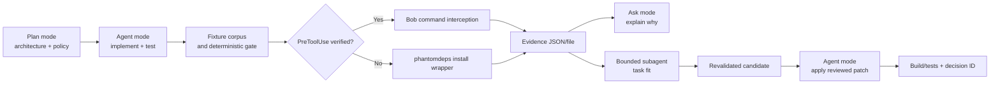
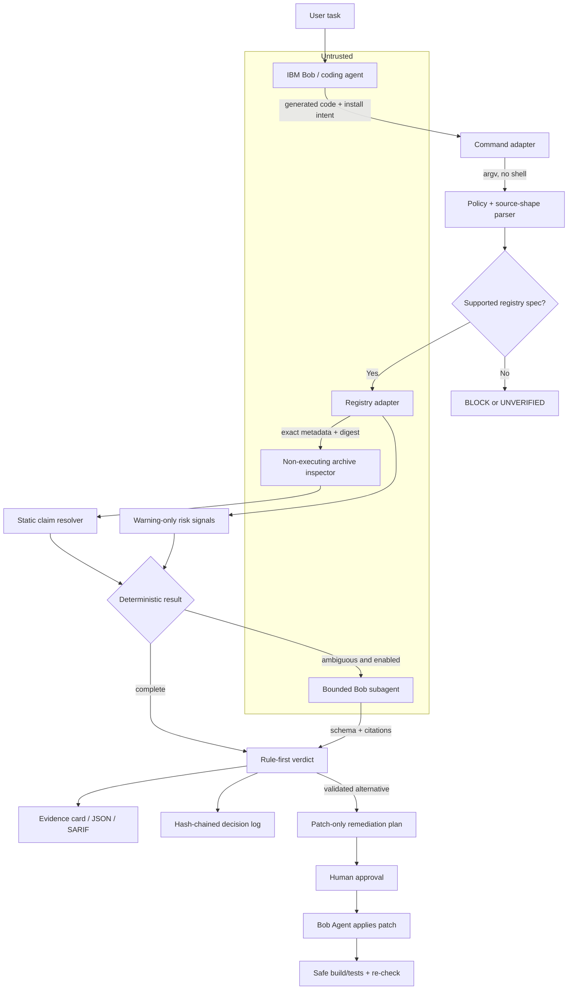

# IBM Bob 2.0 `phantomdeps`: Complete Research, Architecture, Evaluation, and Submission Report

**Author:** Manus AI  
**Research cut-off:** 20 September 2026  
**Project state inspected:** supplied `ibm-bob2` files only  
**Decision:** **PROCEED, but only with a narrower npm-first, fixture-replayable claim gate and an explicit wrapper fallback.**

> **Evidence labels used throughout**
>
> - **CONFIRMED:** directly supported by an authoritative source or by direct inspection of the supplied files.
> - **CORROBORATED:** supported by more than one credible source, or by detailed incident reporting with independently checkable elements.
> - **INFERENCE:** a reasoned interpretation, not an observed fact.
> - **TEAM DESIGN:** a proposed `phantomdeps` decision, interface, policy, or workflow.
> - **TEAM MEASUREMENT:** a result produced by reproducible project artifacts; none exists yet.
> - **ASSUMPTION:** needed for planning but not yet verified.
> - **UNKNOWN:** not established by the reviewed evidence.
>
> These labels qualify the claim immediately following them. A supplied project statement is not independent evidence merely because it appears in several supplied Markdown files.

---

## 1. Executive conclusion

**CONFIRMED:** AI-generated package claims create a real, measurable failure class. A USENIX Security 2025 study evaluated 16 code-generating models on 576,000 Python and JavaScript samples. It identified 440,445 hallucinated recommendations among 2.23 million package recommendations, a **19.7% package-level rate**, and 205,474 unique non-existent names. Commercial-model and open-source-model averages were 5.2% and 21.7%, respectively; GPT-4 Turbo measured 3.59% in the tested configuration. These are study-specific results, not a universal current rate for every model or agent.[1] [2]

**CONFIRMED/CORROBORATED:** The attack path is practical, but the public incidents reviewed here are principally controlled exposure and propagation evidence rather than proof of a major completed breach. Lasso Security’s harmless `huggingface-cli` proof-of-concept received more than 30,000 authentic downloads in three months after AI systems and an Alibaba repository propagated the wrong installation name.[3] Aikido traced `react-codeshift` through AI-generated agent-skill material copied into 237+ repositories and observed real download attempts after publishing a harmless placeholder.[4] Current npm metadata is consistent with Aikido’s placeholder account, while current `unused-imports` metadata shows a security-holding package; registry metadata alone does not prove the original registrant’s motive.[5] [6]

**INFERENCE:** The strongest product opportunity is not another package reputation scanner. It is the earlier decision point where an agent has generated a package-manager command and code that claims a particular package exports a particular API. Existing tools already cover package-name existence, age and reputation heuristics, install interception, known advisories, provenance, and package behavior. The reviewed public documentation does not show the same end-to-end composition of **changed import/API verification + ecosystem validation + bounded task fit + cited repair before installation**, but that absence is not proof that no private or undocumented product does it.

**TEAM DESIGN:** The defensible thesis is:

> **`phantomdeps` is a deterministic-first pre-install claim gate. It verifies the requested ecosystem, exact package artifact, and statically provable API used by an agent’s changed code; it preserves uncertainty as `WARN` or `UNVERIFIED`; and it gives IBM Bob a cited, revalidated, patch-only repair path.**

**CONFIRMED:** This project is currently documentation-only. The inspected directory contains seven Markdown files and no source code, package manifest, tests, fixtures, continuous-integration configuration, license, executable CLI, evaluation corpus, or Bob session export. Every runtime capability described in the supplied files is therefore **DESIGNED ONLY**. No performance, recall, false-block, repair, latency, or Bobcoin claim is a project result.

**CONFIRMED:** The official IBM Bob materials support a strong hackathon fit. Bob documents Agent, Plan, and Ask modes; focused subagents with separate context; native parallel tool calling and background tasks; native reading of common document formats; and lifecycle hooks, including `PreToolUse` blocking with exit code 2.[20] [21] [22] [23] [24] The official hackathon asks for a working prototype that improves a specific developer workflow and demonstrates reduced effort, errors, rework, or elapsed time. It also requires evidence of Bob-assisted work and Bob task-session screenshots.[17] [18]

**Critical correction:** IBM’s documented hook is `PreToolUse`, not the supplied design’s `pre-tool-execution`. Its documented input is `{event, session_id, tool, input}`. For `PreToolUse`, stdout is ignored; exit code 2 blocks the matched tool.[24] Therefore, the current promise that hook stdout becomes an agent-visible evidence-card tool result is **contradicted by official documentation**. The build must persist the evidence card to a known file, use a tested stderr/UI path, or fall back to `phantomdeps install` plus a Bob Ask/Agent follow-up.

**Strongest reason the project could win:** **INFERENCE:** the demo can show a memorable gap that name-only checks miss—“package exists, generated symbol does not”—and turn a security denial into a complete Bob-assisted developer workflow ending in a reviewed patch and green tests.

**Strongest reason it could lose:** **CONFIRMED/INFERENCE:** there is no implementation today, the market already contains strong pre-install controls, the Bob hook experience is only partly known, and the proposed metrics are unmeasured. A broad “AI supply-chain firewall” pitch would be easy to challenge. An npm-first fixture replay with one proven claim mismatch is more credible.

### Executive decision gates

| Gate | Current status | Proceed condition |
|---|---|---|
| Problem validity | **PASS — CONFIRMED** | Keep the claim limited to package hallucination, wrong ecosystem, wrong package, and statically provable API mismatch. |
| Data validity | **PASS with limits — CONFIRMED** | Use npm/PyPI read-only metadata, exact artifacts, hashes, and dated fixtures; do not claim first-party PyPI popularity data. |
| Technical validity | **NOT YET PASSED — UNKNOWN** | Demonstrate one version-pinned real-package/wrong-symbol case without executing package code. |
| Workflow validity | **NOT YET PASSED — ASSUMPTION** | Test Bob `PreToolUse`; otherwise demonstrate the labelled wrapper fallback and Bob repair. |
| Measurement validity | **NOT YET PASSED — UNKNOWN** | Publish at least B0 versus B2 results and one false-block or abstention metric. |
| Demo validity | **NOT YET PASSED — UNKNOWN** | A fresh clone must run the complete fixture demo with networking disabled. |

---

## 2. Verified project state

### 2.1 Files inspected

**CONFIRMED:** The research reviewed the master prompt and all supplied project files:

- `/home/ubuntu/IBM_Bob2_Phantomdeps_Master_Prompt.md`
- `/tmp/ibm-bob2/01-problem-brief.md`
- `/tmp/ibm-bob2/02-gate-design.md`
- `/tmp/ibm-bob2/03-scope-decisions.md`
- `/tmp/ibm-bob2/04-cli-and-config.md`
- `/tmp/ibm-bob2/05-ibm-bob-usage.md`
- `/tmp/ibm-bob2/06-submission-checklist.md`
- `/tmp/ibm-bob2/README (2).md`
- Six independent track reports at `/home/ubuntu/research-track-01-threat.md` through `/home/ubuntu/research-track-06-strategy.md`

### 2.2 Capability ledger at inspection time

| Promised capability | Status now | Evidence or missing artifact |
|---|---|---|
| TypeScript/Node CLI scaffold | **DESIGNED ONLY** | No `package.json`, `src/`, build configuration, or binary. |
| `check`, `install`, `gate`, `why`, `remediate` commands | **DESIGNED ONLY** | Commands appear only in Markdown. |
| npm registry adapter | **DESIGNED ONLY** | No adapter code or tests. |
| PyPI registry adapter | **DESIGNED ONLY** | No adapter code; proposed parity is technically inaccurate. |
| Offline fixture mode | **DESIGNED ONLY** | No fixture directory or replay runner. |
| L1 existence/registry checks | **DESIGNED ONLY** | No HTTP client, schemas, cache, or rule tests. |
| L2 import/API claim resolver | **DESIGNED ONLY** | No parser, package archive resolver, or symbol tests. |
| L3 proximity/squat signals | **DESIGNED ONLY** | No candidate dataset, feature definitions, or calibration. |
| L4 Bob task-fit judgment | **DESIGNED ONLY** | No tested prompt, schema validator, or Bob invocation artifact. |
| `ALLOW/WARN/BLOCK/UNVERIFIED` decision engine | **PROPOSED** | `UNVERIFIED` was absent from parts of the supplied CLI design and must become first-class. |
| Evidence card, JSON, and SARIF | **DESIGNED ONLY** | Examples exist; serializers do not. |
| Bob `PreToolUse` hook | **ASSUMPTION** | Official event and hook capability exist, but exact command input/UI behavior must be tested. |
| Patch-only remediation | **PROPOSED** | Safer replacement for the supplied auto-install/PR concept. |
| Hash-chained decision log | **PROPOSED** | Supplied NDJSON is only nominally append-only and has no integrity chain. |
| Evaluation corpus and metrics | **DESIGNED ONLY** | No cases, labels, runner, or results. |
| CI, license, NOTICE, public repository | **MISSING** | Required submission hygiene is not present. |
| Bob session summaries and task-to-commit map | **MISSING** | Must be captured during the build. |
| Hosted application/replay URL | **MISSING** | General submission guidance asks for an application URL.[19] |

### 2.3 Claims that must be corrected before reuse

| Supplied claim | Correct status | Required wording |
|---|---|---|
| “31.2% of answers contain a fake package.” | **UNKNOWN/UNSUPPORTED here** | Use the paper-supported 19.7% package-level result and define the study population.[1] [2] |
| “Socket coined slopsquatting in 2026.” | **INCORRECT** | Socket’s April 2025 article attributes the term to Seth Larson and its popularization to Andrew Nesbitt.[7] |
| “~5,000 attacks; >80% credential theft.” | **UNKNOWN; DO NOT USE** | No stable authoritative source reviewed here established the count and denominator. |
| “Postinstall is npm’s most common attack vector.” | **UNSUPPORTED ranking** | npm confirms lifecycle scripts execute during install; it does not establish this frequency ranking.[8] |
| “Agents remove the human checkpoint.” | **OVERBROAD** | Agents **can** reduce or remove review when granted install authority or bypass permissions. |
| “All existing tools are name gates/post-merge.” | **FALSE** | `npq`, slopcheck wrappers, Aikido SafeChain, and Socket controls already operate before or during installation.[9] [10] [11] [12] |
| “PyPI exposes download behavior in official JSON.” | **FALSE** | PyPI’s official JSON `downloads` fields are deprecated and always `-1`.[35] |
| Weighted risk thresholds are validated. | **TEAM DESIGN only** | Use rule-first verdicts; keep any scalar display-only until calibrated. |
| `pre-tool-execution` receives task, diff, model. | **UNCONFIRMED** | Test documented Bob `PreToolUse` and its actual `input` shape.[24] |
| Hook stdout becomes an evidence-card tool result. | **CONTRADICTED** | Official docs say `PreToolUse` stdout is ignored.[24] |
| Enterprise activity log is coding provenance. | **INCORRECT scope** | It documents authentication/admin activity, not package decisions.[26] |
| Bobalytics proves less than 20% AI spend. | **UNCONFIRMED** | Bobalytics is Enterprise-only and its published KPIs do not provide this gate-level split.[27] [28] |
| “Append-only NDJSON” is immutable. | **OVERSTATED** | A local file is mutable; use hash chaining and describe it as tamper-evident only within retained history. |
| Recall, false blocks, latency, and repair time meet targets. | **UNKNOWN** | Keep values as **TARGETS** until generated by a versioned benchmark. |

---

## 3. Problem archaeology and threat model

### 3.1 Three precise problem statements

**Technical — TEAM DESIGN:** An AI-assisted development workflow may bind generated source code to a non-existent, wrong-ecosystem, wrong-purpose, or API-incompatible dependency and execute the corresponding package-manager command before that claim is independently checked.

**Developer-centered — TEAM DESIGN:** A developer needs an agent to stop before installing a dependency that does not match the code it just wrote, explain the mismatch with inspectable evidence, and offer a tested path forward instead of creating a later build failure or security incident.

**Judge-facing — TEAM DESIGN:** **`phantomdeps` makes an agent prove its dependency claim before installation, then gives IBM Bob cited evidence and a reviewable repair.**

### 3.2 How the failure develops

**CONFIRMED:** The USENIX work establishes that models produce non-existent package names and that repeated hallucinations occur.[1] [2] **CONFIRMED:** npm can execute `preinstall`, `install`, and `postinstall` lifecycle scripts during dependency installation.[8] **CORROBORATED:** Lasso and Aikido show that hallucinated names can propagate into public instructions and attract genuine downloads.[3] [4]

**INFERENCE:** The risk becomes more acute when an agent controls both code generation and shell execution. This does not mean every agent bypasses consent. It means the control point must be placed before package-manager execution in environments where installation is delegated.

### 3.3 Attack and failure classes

| Class | What has failed | v1 action | Basis and boundary |
|---|---|---|---|
| Non-existent public package | Registry identity claim | **BLOCK** | **TEAM DESIGN:** hard failure when the configured public index returns a valid 404; private-index ambiguity becomes `UNVERIFIED`. |
| Name exists only in another ecosystem | Ecosystem claim | **BLOCK** | **CONFIRMED** as a measurable class: 8.7% of hallucinated Python names in the USENIX dataset matched valid npm packages.[1] [2] |
| Previously hallucinated name is now registered | Identity alone is insufficient | **WARN**, or **BLOCK** only on an independent hard failure | Registration does not prove malice; check artifact, scripts, API, and provenance. |
| Real package, wrong purpose | Task claim | **WARN** by default | README/task fit is interpretive; block only when accompanied by deterministic mismatch or explicit policy. |
| Real package, imported symbol is deterministically absent | API claim | **BLOCK** | Only when exact version, module condition, subpath, and static evidence prove absence. |
| Real package, API ambiguous/dynamic | Evidence quality | **UNVERIFIED/WARN** | Dynamic CommonJS, generated exports, native code, or stale declarations cannot justify a hard negative. |
| Suspicious provenance profile | Reputation/trust | **WARN** | Youth, downloads, maintainer count, repository reachability, and missing attestation are not proof of malice. |
| Risky transitive addition | Dependency-graph risk | **ROADMAP; record if visible** | Full lockfile/transitive analysis is too broad for the core slice. |
| Legitimate package is compromised after approval | Behavioral/update risk | **OUT OF SCOPE** | Requires behavioral, advisory, integrity, and continuous monitoring controls. |
| URL, VCS, local path, archive, alias, or `curl | sh` | Gate bypass/source shape | **BLOCK/UNVERIFIED under strict policy** | v1 should support registry-name specs only and never forward unparsed shell text. |
| Registry timeout, rate limit, stale cache, malformed response | Evidence unavailable | **UNVERIFIED** | Never mislabel unavailability as non-existence or silently convert it to `ALLOW`. |
| Gate creates false blocks or habitual overrides | Control failure | **WARN-first + measured overrides** | Require reasons, record outcomes, and test legitimate young packages. |

### 3.4 Actors, assets, and abuse goals

| Actor | Plausible action | Assets at risk | Control objective |
|---|---|---|---|
| Coding model or agent acting incorrectly | Generates the wrong package/API and attempts installation | Source integrity, build time, developer trust | Stop unverified execution and preserve evidence. |
| Package publisher or attacker | Registers a repeated hallucinated name or misleading near-neighbor | Credentials, source, CI secrets, cache integrity | Validate identity/artifact and prevent weak reputation from becoming certainty. |
| Compromised maintainer/build pipeline | Publishes a malicious but correctly named update | Build integrity, endpoints, production | **Residual risk:** use signatures, attestations, behavioral analysis, and locked artifacts. |
| Malicious package documentation | Injects instructions into L4 or remediation | Model behavior, repository writes, secrets | Treat README as untrusted data; no tools; citation and candidate revalidation. |
| Local user or compromised process | Edits cache/log, bypasses wrapper, runs another installer | Decision integrity, provenance | Hash-chain logs, strict CI path, disclose local bypass limits. |
| Registry or network adversary | Serves stale/malformed data or causes denial of service | Verdict correctness and availability | HTTPS, digests, size limits, timeouts, explicit unavailable state, dated fixtures. |

### 3.5 Threat path as a text flowchart

```text
User task
  -> model generates source import + package-manager command
  -> [TRUST BOUNDARY] agent requests shell/tool execution
  -> phantomdeps parses argv and freezes the relevant diff
       -> unsupported source shape? BLOCK or UNVERIFIED
       -> registry unavailable? UNVERIFIED
       -> wrong ecosystem / public 404 / integrity mismatch? BLOCK
       -> exact static export mismatch? BLOCK
       -> weak reputation or ambiguous export? WARN
       -> required checks complete? ALLOW
  -> evidence JSON/card + decision-log record
  -> validated candidate patch
  -> [HUMAN APPROVAL]
  -> Bob Agent applies only the reviewed patch
  -> safe build/tests using existing dependencies
  -> gate re-check + result linked to the decision ID
```

### 3.6 Source quality and uncertainty

The USENIX paper is the strongest quantitative source and should anchor prevalence claims.[1] [2] Lasso and Aikido are primary vendor incident reports: their controlled actions and observations are useful, but interpretations about attacker intent, complete causality, or autonomous execution are not equivalent to peer-reviewed measurement.[3] [4] npm, PyPI, Node.js, TypeScript, pip, IBM, and lablab documentation are authoritative for their documented interfaces at the research cut-off, but product and event details can change.

---

## 4. Source-verified evidence table

| Claim | Status | What the source actually supports | Safe use in the project |
|---|---|---|---|
| 19.7% of 2.23 million package recommendations were hallucinated; 205,474 unique names | **CONFIRMED** | Study of 16 models, 576,000 Python/JavaScript samples, fixed prompts/settings/snapshots.[1] [2] | Present as a study-specific package-level result. |
| Commercial average 5.2%; open-source average 21.7%; GPT-4 Turbo 3.59% | **CONFIRMED** | Results under the study’s tested configurations.[1] [2] | Do not generalize to current models or all agents. |
| 8.7% of hallucinated Python names were valid npm names | **CONFIRMED** | 6,705 of 76,489 hallucinated Python names matched npm packages.[2] | Supports a wrong-ecosystem class, not maliciousness. |
| `huggingface-cli` received >30,000 authentic downloads in three months | **CONFIRMED by primary incident source** | Lasso intentionally uploaded a harmless package and compared downloads with a dummy package.[3] | Call it a controlled proof-of-concept, not a breach. |
| Alibaba documentation propagated the wrong `huggingface-cli` command | **CONFIRMED by primary incident source** | Lasso located the instruction in a public Alibaba repository.[3] | Demonstrates documentation propagation. |
| `react-codeshift` appeared across 237+ repositories and attracted downloads after a safe placeholder was published | **CORROBORATED** | Aikido traced an AI-generated skill, forks/copies/translation, and 1–4 downloads/day; npm metadata confirms a placeholder record.[4] [5] | Use dated historical replay; do not call the placeholder malware. |
| `unused-imports` was malicious | **CORROBORATED with attribution caveat** | Aikido reports malicious behavior; current npm metadata shows a security-holding replacement.[6] [12] | Say “Aikido reported”; do not infer registrant identity/motive from metadata. |
| npm lifecycle scripts can execute during installation | **CONFIRMED** | npm documents lifecycle execution for install/ci.[8] | Supports pre-install defense-in-depth. |
| `npm audit` checks known advisories for a configured dependency tree | **CONFIRMED** | Official command scope; `audit fix` performs dependency remediation.[9] | A clean audit is not proof of package legitimacy, task fit, or API correctness. |
| PyPI JSON supplies live downloads | **REFUTED** | Official `downloads` values are deprecated and always `-1`.[35] | Do not score PyPI popularity from this field. |
| Provenance proves safety | **REFUTED** | npm and PyPI state that provenance/attestations establish origin or build identity, not benign code.[14] [15] [38] | Treat as one evidence dimension, never a safety verdict. |
| Bob supports Agent, Plan, Ask, subagents, parallel/background work, documents, and lifecycle hooks | **CONFIRMED** | Official IBM documentation.[20] [21] [22] [23] [24] | Make each visible and evidence-backed where used. |
| Bob `PreToolUse` stdout becomes the tool result | **REFUTED** | Official docs say stdout is ignored and exit 2 blocks the tool.[24] | Persist evidence separately and test UI behavior. |
| ~5,000 slopsquatting attacks and >80% credential theft | **UNKNOWN** | No stable primary source reviewed here established the figure/denominator. | Exclude from report, deck, and video. |

---

## 5. Current prior-art matrix

| Solution | Timing | Documented strengths | Generated API/task context | Remediation/evidence | Precise boundary for `phantomdeps` |
|---|---|---|---|---|---|
| **slopcheck** | Scan, install wrapper, pre-commit, PR | Multi-ecosystem existence, age/download/name/repository heuristics; JSON and fix modes.[10] | No generated symbol/export or original-task check is documented. | Can remove/comment suspect entries; output/PR evidence. | Do not compete on name existence. Benchmark on real-package/wrong-API cases. |
| **npq** | Before npm/yarn/pnpm install | Vulnerabilities, age, downloads, scripts, author/publisher, signatures, provenance, version maturity, typosquatting.[11] | Its documentation does not present generated import/task checking and explicitly cautions that suggested versions are not API/runtime compatibility evaluation. | Rich pre-install report; delegates to package manager. | Closest open-source pre-install comparator. Show incremental claim evidence, not more heuristics. |
| **Socket** | CLI/API, dependency changes, install-time firewall | Package behavior, install scripts, ownership/maintainer anomalies, 70+ risk signals, broad ecosystems.[12] [13] | Reviewed docs emphasize package/dependency behavior and say customer source code is not analyzed in the cited FAQ. | Actionable findings and policy controls; no reviewed evidence of task-bound code migration. | Complement, not replace: claim correctness before install versus package behavior/security. |
| **Aikido Intel / SafeChain** | Threat feed and package-manager interception | Known malicious packages, threat intelligence, pre-install wrapper.[4] [16] | No generated symbol or original-task contract is documented in reviewed sources. | Block/allow; code migration not documented. | Agent interception alone is not novel; claim binding and repair must be measured. |
| **`npm audit`** | Configured dependency tree | Known advisories, meta-vulnerabilities, optional signature audit.[9] | No proposed-package or task/API claim input. | `audit fix` remediates vulnerable versions. | A necessary downstream baseline, not a hallucination detector. |
| **npm/PyPI provenance** | Publish/artifact verification | Artifact digest, publisher/workflow identity, signatures and attestations.[14] [15] [38] | Does not prove task fit or exported API. | Verification evidence; no code repair. | Consume as evidence without equating “attested” with “safe.” |
| **Claude Code hooks** | Before tool execution | Documented generic allow/deny/ask/defer pattern and structured tool input.[39] | Hook author supplies security semantics. | Can deny; package repair is external. | Confirms the integration pattern, not Bob parity or novelty. |
| **IBM Bob `PreToolUse`** | Before matched Bob tool | Official exit-2 blocking and JSON stdin.[24] | Actual task/diff fields beyond documented input are not guaranteed. | Bob reports blocked tool; stdout ignored. | Test the real `execute_command` payload; retain wrapper fallback. |
| **Official MCP Registry** | Discovery/metadata | Namespace authentication and standardized server metadata; deeper scanning delegated.[40] | Not a generated package API/task validator. | Metadata, not package migration. | Adjacent identity control; avoid conflating MCP identity with package correctness. |

**INFERENCE:** The competitive landscape is crowded at L1 and package-risk analysis. The credible wedge lives at the **claim graph**: proposed command → changed import → exact package artifact → public export → task evidence → revalidated alternative → patch/test/provenance.

### What competing hackathon teams are likely to build

| Team tier | Likely build | Why it is insufficient as `phantomdeps` differentiation |
|---|---|---|
| Typical team | Registry 404 checker, age/download score, red/green dashboard | Established behavior; weak against existing packages and false positives. |
| Strong team | Pre-install wrapper, threat-intelligence API, SARIF/CI, Bob-written summary | Strong packaging but still package-centric unless it binds to changed imports. |
| Elite team | Static artifact inspection, policy engine, offline fixtures, measured corpus, repair diff | Substantial overlap; `phantomdeps` must win on exact claim evidence and workflow measurement. |
| Top-tier team | Multi-agent workflow, provenance, hosted replay, adversarial corpus, polished judge defense | The remaining moat is reproducibility, bounded safety, and honest incremental results—not the idea alone. |

---

## 6. Research gap and precise novelty boundary

### 6.1 Existing approach → limitation → remaining gap → testable contribution

1. **CONFIRMED:** name/existence gates identify 404s and suspicious names. **INFERENCE:** they allow a real package that lacks the generated API. **TEAM DESIGN:** test whether static changed-import verification adds recall on real-package/invented-symbol cases.
2. **CONFIRMED:** package-risk tools inspect behavior, vulnerabilities, scripts, maintainers, provenance, and threat feeds. **INFERENCE:** their reviewed public inputs are package-centric rather than original-task plus changed-code claims. **TEAM DESIGN:** test whether contextual claim evidence detects errors before behavioral evidence exists.
3. **CONFIRMED:** signatures and attestations authenticate artifacts and publication paths. **INFERENCE:** an authentic package can still be wrong for the task. **TEAM DESIGN:** show provenance and task/API correctness as separate fields.
4. **CONFIRMED:** generic hooks provide a pre-tool policy point. **INFERENCE:** a hook has no package semantics by itself. **TEAM DESIGN:** bind a safely parsed install command to deterministic registry/static evidence and a machine-readable repair.
5. **CONFIRMED:** Bob can plan, explain, edit, test, and delegate focused tasks.[21] [22] **TEAM DESIGN:** measure whether a cited, revalidated patch reduces block-to-green time versus block-only output.

### 6.2 Candidate contribution status

| Candidate | Status | Defensible statement |
|---|---|---|
| Registry existence/health | **ESTABLISHED** | Necessary baseline with substantial prior-art overlap. |
| Cross-ecosystem collision detection | **UNDEREXPLORED / UNCERTAIN** | Measurable signal; do not claim market-first novelty. |
| Version-pinned generated import/API verification | **UNDEREXPLORED / UNCERTAIN** | Primary project differentiator in reviewed documentation; broader novelty remains unknown. |
| Bounded task + snippet + README fit judgment | **UNDEREXPLORED / UNCERTAIN** | Evaluate with citations, abstention, and injection resistance. |
| Name similarity/reputation | **ESTABLISHED** | Use as warnings; it is not the moat. |
| Agent pre-install interception | **ESTABLISHED pattern** | Product-specific enforcement is implementation work, not a research invention. |
| Cited, revalidated repair | **UNCERTAIN / TEAM DESIGN** | Measure versus block-only; do not say competitors cannot remediate. |
| Decision provenance | **TEAM DESIGN; primitives established** | Complements package provenance; not equivalent to immutable audit or artifact attestation. |
| Calibration and workflow evaluation | **TEAM MEASUREMENT** | Potential evidence contribution after the benchmark is published. |

### 6.3 Precise novelty boundary

> **INFERENCE, not a patent or market-exhaustiveness claim:** Reviewed tools document registry-name checks, package-risk analysis, known-advisory scans, provenance, threat intelligence, install interception, or generic tool hooks. The reviewed documentation does not establish the exact complete workflow in which a pre-install gate resolves the agent’s changed import against the exact package artifact, uses bounded task evidence only when needed, revalidates alternatives, and returns a patch/test/provenance path. `phantomdeps` should call this an explored and measured composition, not “the first” or “unique.”

**UNKNOWN:** Public documentation can omit private features, newly released capabilities, and internal enterprise controls. This work is not a patentability opinion.

### 6.4 Testable hypotheses

- **H1 — incremental claim detection, TEAM DESIGN:** B2/B3 will detect a material share of version-pinned real-package/invented-symbol cases that B0 name existence allows.
- **H2 — deterministic efficiency, TEAM DESIGN:** L1–L3 will resolve most corpus cases without L4, lowering p50 latency and model-call rate relative to an AI-first reviewer.
- **H3 — workflow completion, TEAM DESIGN:** B4 block-plus-remediation will reduce median block-to-green time versus block-only evidence on fixed tasks.
- **H4 — calibration, TEAM DESIGN:** rule-first hard blocks plus `WARN/UNVERIFIED` will produce fewer false blocks on legitimate-young and dynamic-export cases than the supplied uncalibrated scalar threshold.

No hypothesis is confirmed until a committed corpus, runner, and report reproduce it.

---

## 7. IBM Bob 2.0 official-fit analysis

### 7.1 Official capability fit

| Official Bob capability | Status | Load-bearing use in `phantomdeps` | Required evidence |
|---|---|---|---|
| Agent mode | **CONFIRMED** for implementation, modification, and tests.[21] | Implement gate; apply a reviewed remediation patch; run safe project tests. | Session summary, changed files, test output, commit. |
| Plan mode | **CONFIRMED** for reviewable implementation plans.[21] [29] | Define narrow resolver grammar, policy, threat model, and acceptance tests before coding. | Plan file, review comments, Agent handoff. |
| Ask mode | **CONFIRMED** read-only analysis/explanation.[21] | Explain why a claim was blocked using the evidence file. | Ask transcript with citations; no edits. |
| Focused subagents | **CONFIRMED** separate context and returned summary; inputs must be passed explicitly.[22] | Read-only L4 task-fit analysis with task, snippet, and bounded README only. | Subagent prompt, approval, output schema, no tool authority. |
| Parallel/background work | **CONFIRMED**.[23] [30] | Independent candidate-fit checks, corpus slices, or adapter test work. | Task panel and actual wall time; no promised speedup. |
| Document understanding | **CONFIRMED, version-qualified** for common document formats.[23] [30] | Extract research/package evidence, followed by source verification. | Source-linked extraction plus reviewer check. |
| Lifecycle `PreToolUse` | **CONFIRMED** exit-2 blocking; stdout ignored.[24] | Optional native interception of `execute_command`. | Actual settings, payload capture, harmless block test, version. |
| Chat/task history | **CONFIRMED**, local and retention-limited.[25] | Judging evidence, not security provenance. | Immediate exports/screenshots. |
| Enterprise activity log | **CONFIRMED but irrelevant to coding provenance**.[26] | Do not use as package-decision proof. | None required. |
| Bobalytics | **CONFIRMED, Enterprise-only and coarse**.[27] [28] | Optional usage evidence, not deterministic/AI gate-cost attribution. | Export if available; otherwise `UNKNOWN`. |

### 7.2 Official challenge and submission fit

**CONFIRMED:** The event is described by lablab.ai and IBM Developer as an online 48-hour IBM Bob 2.0 hackathon on 25–27 September 2026 with a current $10,000 prize pool; IBM employees are ineligible.[17] [18] Event details can change and must be rechecked at submission.

**CONFIRMED:** The challenge asks for improvement to a specific developer workflow and names Agent mode, parallel tasks, subagents, and document understanding. Judging covers completeness/application of Bob, presentation, practical impact, and uniqueness/creativity.[17] This project fits **maintenance, debugging, security review, and release gating** only if it shows the complete path from blocked action to verified repair.

**CONFIRMED:** The official event page requires project descriptions, tags, cover image, video, slides, demo platform/application URL, Bob-assisted files, and Bob task-session screenshots.[17] The general submission guide asks for a public GitHub repository, exported Bob report, PDF slides, an application URL, and a video no longer than five minutes.[19] A **2–4 minute** video is a team strategy within that maximum, not a separate official requirement.

**CURRENT PAGE DETAIL / RECHECK:** The live page reported a submission close of **27 September 2026 at 15:00 UTC** at the research cut-off.[31] Capture the live page and form immediately before submission.

### 7.3 Correct Bob architecture

**TEAM DESIGN:** Use Bob where context and judgment add value. Registry facts, artifact hashes, static parsing, cache logic, policy, and verdict rules remain deterministic. Bob’s L4 judgment is bounded and optional. Bob Agent remediation follows deterministic candidate revalidation and human approval.

**ASSUMPTION:** The installed Bob build will expose `PreToolUse` for the relevant command tool with a parseable command field. Test this at event start. If the assumption fails, the wrapper remains the supported enforcement path.

**UNKNOWN:** Bobcoin allocation, custom workflow-authoring APIs, specific watsonx entitlements, cloud credits, fixed concurrency, and any event-specific hook restrictions. Do not build the core around them.

### 7.4 Bob build-time and runtime evidence map



Each arrow must have a repository artifact: plan, source diff, test, fixture, payload capture, evidence file, subagent output, patch, test log, or session export.

---

## 8. User, buyer, and workflow analysis

| Persona | Current pain | Current workaround | Failure cost | Adoption barrier | Evidence artifact needed |
|---|---|---|---|---|---|
| Developer using an AI coding agent | Late `module not found`, wrong API, manual package research, unsafe install uncertainty | Review package pages, retry prompts, replace imports after failure | Lost time, broken workspace, possible credential exposure | False blocks and slow checks | Short evidence card, exact mismatch, safe next step, patch. |
| Platform/build engineer | Agents can alter manifests and shared caches before policy review | CI allowlists, restricted runners, `ignore-scripts`, manual approvals | Cache poisoning, failed builds, inconsistent environments | Wrapper bypass and availability | Machine JSON/SARIF, strict exit codes, cache state, command digest. |
| Application security | Existing dependency tools may lack the agent’s intent and changed import | SCA, advisory scans, PR review, threat feeds | Unknown package intent and delayed triage | Tool overlap and alert fatigue | Rule IDs, exact artifact/hash, source citations, override record. |
| Security/compliance lead | Needs traceable authorization for agent-introduced dependencies | Tickets, screenshots, procurement review | Weak auditability and policy exceptions | Privacy and mutable local logs | Redacted hash-chained decision provenance and signed CI export roadmap. |
| Open-source maintainer | AI-generated instructions can spread wrong names and support burden | Correct docs/issues after propagation | Reputation damage and install attempts at unrelated names | False implication that a package is malicious | Careful labels, capture date, correction/remediation link. |
| Organization allowing coding agents | Wants automation without unconstrained package execution | Disable shell tools or require broad approvals | Productivity loss or unmanaged risk | Integration coverage and private registries | Enforced wrapper/hook evidence, policy version, bypass disclosure. |
| IBM Bob user/team | Needs a visible, useful Bob workflow rather than a logo | Manual prompting and ad hoc screenshots | Weak judging proof and poor reproducibility | Hook/version uncertainty | Plan/Agent/Ask/subagent artifacts linked to commits and decisions. |

### 8.1 Before and after workflow

**Baseline — CORROBORATED/INFERENCE:** agent proposes code and dependency; a developer approves or the agent runs the install; incompatibility may appear at build time, while package-security tools separately analyze reputation or advisories.

**Proposed — TEAM DESIGN:** the install-shaped command is parsed before execution; changed imports and exact package evidence are checked; the gate returns a structured decision; Bob explains or applies a reviewed, revalidated patch; safe tests verify the repository; a decision record links the action and outcome.

### 8.2 Buyer value without inflated security claims

**INFERENCE:** The economic value is reduced dependency-related rework and a more auditable agent permission boundary. The product does not yet have pricing, willingness-to-pay, deployment, or longitudinal user evidence. The likely enterprise buyer is platform security or developer-platform leadership, while the daily user is a developer. Treat buyer fit as a validation hypothesis, not a confirmed market.

---

## 9. Four-layer architecture review

### 9.1 Corrected architecture principle

**TEAM DESIGN:** Separate high-confidence invariants from weak signals. Use a rule engine to produce `BLOCK`, `WARN`, `ALLOW`, or `UNVERIFIED`. If a numeric risk score is retained, show it only as an uncalibrated ranking until corpus results justify thresholds.

### 9.2 L1 — identity, artifact, and registry state

**Keep:** configured ecosystem/index, normalized name, exact version/tag resolution, 404 versus unavailable, yanked/deprecated state, selected artifact URL, digest/integrity, file size, release time, scripts/build surface, and cache state. npm packuments expose rich version and distribution metadata; PyPI JSON/Simple expose releases, files, hashes, upload time, `Requires-Python`, yanks, and core metadata.[32] [33] [35] [36] [37]

**Correct:** age, maintainer count, repository reachability, downloads, and publication cadence are contextual observations. They should not share one “existence risk” scalar and should not hard-block by themselves. Ownership-transfer detection is **UNKNOWN** in the proposed public-data design and should be deferred.

**Adapter result — TEAM DESIGN:** `FOUND | NOT_FOUND | UNAVAILABLE | PRIVATE_OR_UNAUTHENTICATED`, plus observations that retain source, retrieval time, cache state, and response hash.

### 9.3 L2 — static claim/API verification

**Keep:** parse only newly changed imports; resolve against the exact selected npm version’s `exports`, `main`, bundled `types`/`typings`, package files, and condition matched to the source form. Node documents conditional and subpath exports; TypeScript declaration files describe module exports.[41] [42]

**Narrow:** v1 supports bare npm package imports in `.ts`, `.tsx`, `.js`, and `.mjs`, with static ESM named/default/namespace forms and explicitly tested subpaths. `require`, dynamic `import()`, generated exports, native extensions, package self-reference, path aliases, and unresolved conditional CommonJS become `UNVERIFIED` unless implemented and tested.

**Safety:** a `.d.ts` file expresses intended types, not guaranteed runtime behavior. `@types` can be stale or version-mismatched. A hard `SYMBOL_MISSING` requires exact-version, condition-matched, internally consistent evidence. Otherwise return `AMBIGUOUS_EXPORTS` as `WARN/UNVERIFIED`.

### 9.4 L3 — proximity and suspicious profile

**Keep as explainable warnings:** normalized name distance, cross-ecosystem hit, proximity to project dependencies, recent publication, limited release history, script presence, missing provenance, and inconsistent repository evidence.

**Cut from core:** live top-10k datasets, keyboard-layout weighting, repository-star/download ratios, unsupported ownership-transfer inference, and any scalar that turns multiple weak signals into “malicious.” A dated, committed candidate index is more reproducible.

### 9.5 L4 — bounded task fit

**TEAM DESIGN:** Invoke L4 only when policy enables it and deterministic checks cannot answer whether a real package fits the user’s task. Provide only:

1. the original task or a redacted task reference;
2. the relevant generated snippet;
3. a bounded, sanitized README/document extract with line mapping and content hash.

The subagent receives no shell, install, network, or write tools. README content is explicitly delimited as untrusted data. Output must pass a schema, cite source lines, and allow abstention. Every proposed alternative is re-run through L1/L2. Missing citations or invalid output becomes `UNVERIFIED/WARN`, never a block or install instruction.

### 9.6 Verdict semantics

| Verdict | Meaning | Default human behavior | Agent/CI strict behavior |
|---|---|---|---|
| `ALLOW` | Required checks completed; no hard finding; policy permits artifact | May proceed | May proceed with exact checked spec/digest where possible |
| `WARN` | Weak risk signal or bounded ambiguity with enough evidence to continue under policy | Prompt or proceed with visible record | Require configured approval; do not silently continue |
| `BLOCK` | High-confidence claim/integrity/policy failure | Stop unless privileged, reasoned override | Deny tool/package-manager execution |
| `UNVERIFIED` | Network, cache, parser, private index, malformed data, or unsupported syntax prevents reliable decision | Exit distinctly; optional explicit allow-with-warning | Fail closed with distinct unavailable reason |

**Hard-block floor — TEAM DESIGN:** configured public 404; explicit wrong ecosystem; exact version absent/yanked/deprecated under policy; digest mismatch; invalid supported signature/attestation under strict policy; prohibited source shape; or version-pinned, condition-matched proof that a required symbol is absent.

### 9.7 End-to-end text architecture

```text
CommandAdapter
  parses argv without a shell
  -> InstallIntent {origin, ecosystem, specs, cwd, decisionContext}

ContextCollector
  reads changed manifest/import/lockfile evidence only
  -> ClaimSet {package, subpath, importKind, symbols, sourceLocations}

RegistryAdapter
  resolves configured index + exact version/artifact
  -> PackageEvidence {metadata, integrity, provenance, scripts, cache}

StaticClaimResolver
  inspects bounded archive/typings/exports without execution
  -> ClaimFinding {resolved | missing | ambiguous, citations}

RiskSignals
  adds warning-only proximity/reputation observations

Optional TaskFit
  reads bounded untrusted docs; no tools; schema + citations

PolicyEngine
  rule-first ALLOW/WARN/BLOCK/UNVERIFIED

EvidenceWriter
  terminal card + JSON + optional SARIF + hash-chained NDJSON

RemediationPlanner
  revalidates candidate -> emits patch only -> human approval

Bob Agent
  applies reviewed patch -> runs safe build/tests -> re-checks gate
```

### 9.8 Component and trust-boundary diagram



### 9.9 What the supplied design gets right and what changes

| Design element | Decision |
|---|---|
| Deterministic checks before model reasoning | **PRESERVE** |
| Changed-import claim verification | **PRESERVE AND NARROW** |
| Cross-ecosystem result | **PRESERVE** |
| Four layers as explanatory model | **PRESERVE** |
| Weighted 0.45/0.25/0.20/0.10 verdict | **REPLACE with rule-first semantics** |
| L4 mandatory for every candidate | **CHANGE to optional/inconclusive-only** |
| Automatic install and repository-wide PR | **REPLACE with patch-only + approval** |
| Same npm/PyPI score | **REJECT** |
| Raw shell command matching/re-execution | **REJECT** |
| Ten-minute cache without key/schema | **REPLACE with versioned, hashed records** |
| Local NDJSON described as immutable | **CORRECT to hash-chained local decision provenance** |
| Native Bob hook as required core | **CHANGE to tested enhancement; wrapper is core fallback** |


---

## 10. Security and safety review

### 10.1 Security objectives and non-objectives

**TEAM DESIGN:** The core objective is to stop a narrow set of unverified **dependency claims** before package-manager execution. It is not to certify a package as benign. A correct `ALLOW` means the selected evidence and policy checks passed; it must never be rendered as “safe package.”

**Explicit non-objectives:** malicious updates to a legitimate correctly used package; a compromised registry or package manager; a malicious package that genuinely exports the claimed API; arbitrary unhooked human commands; complete private-registry policy; comprehensive transitive behavior; non-npm/PyPI ecosystems; and arbitrary `curl | sh` execution unless a separate command policy catches it.

### 10.2 Trust-boundary review

| Boundary | Asset | Abuse path | Minimum mitigation | Residual risk |
|---|---|---|---|---|
| User task → model | Task integrity and sensitive context | Prompt injection or ambiguous intent produces unsafe dependency choice | Pass only necessary task context; retain a task hash/redacted reference | Model can still misunderstand intent. |
| Model/code → shell tool | Credentials, repository, build host | Agent installs, uses a bypass form, or chains shell commands | Parse argv; reject shell metacharacters/unsupported forms; strict wrapper; tested hook | Unmatched tools, scripts, and humans can bypass. |
| Gate → public registry | Verdict availability and identity | Timeout, rate limit, private index mismatch, DNS/registry compromise | Configured index, TLS, bounded timeout/retry, explicit states, exact URL, fixture mode | Compromised authoritative registry or network remains possible. |
| Registry → archive parser | Gate process and filesystem | Zip/tar bomb, path traversal, parser exploit, malformed JSON | Byte/file/depth limits, safe extraction, schema validation, isolated staging, no execution | Parser/library vulnerabilities remain. |
| Artifact metadata → L2 | Decision correctness | Stale declarations, conditional exports, generated API | Exact version/condition, corroborate sources, abstain on ambiguity | Runtime may differ from static declarations. |
| README → L4 model | Model instruction integrity | Documentation tells model to ignore policy, exfiltrate, or recommend an attacker package | Delimit as untrusted, no tools, size cap, citations, schema validation, candidate recheck | Model can still misclassify. |
| Gate → Bob remediation | Source and lockfile integrity | Model makes broad edits or selects another unverified package | Patch-only scope, exact candidate evidence, human approval, safe tests, re-check | Semantically wrong but syntactically valid migration. |
| Decision log → CI/AppSec | Provenance and privacy | Tampering, deletion, secrets or path leakage | Redaction, hash chain, permissions, retention, exported digest | Local chain has no external trust anchor. |
| Cache → policy engine | Freshness and verdict correctness | Poisoned/stale cache returns a confident allow | Exact cache key, response hash, schema version, stale semantics, no strict stale allow | Compromised local filesystem. |

### 10.3 Safe command interception

**TEAM DESIGN:** Never interpolate or re-execute raw shell input. Tokenize the documented tool input into an argument array; reject separators, substitutions, redirections, pipes, environment assignments, response/requirements files, URLs, VCS references, local paths, aliases, workspaces, and archives unless a dedicated parser and policy exists. Invoke the real package manager with an argument array and `shell: false` only after `ALLOW`.

Supported v1 input should be intentionally narrow: `npm install|add <registry-name[@version-or-tag]>`, including scoped names, one package at a time for the complete claim path. Everything else is `UNVERIFIED` or policy-blocked, not heuristically forwarded. npm and pip accept many non-registry source forms, so a name-only regex is not an enforcement boundary.[43] [44]

### 10.4 Non-executing artifact inspection

**TEAM DESIGN:** Download artifacts only as bytes into a staging directory. Verify the recorded digest before parsing. Enforce compressed and uncompressed byte limits, file-count and path-depth limits, reject absolute paths and `..` traversal, and never load the package through Node.js or Python. Parse only manifests, declarations, export maps, static module syntax, wheel metadata, and file listings. Delete the staging tree after retaining hashes and the minimal evidence snapshot.

**CONFIRMED:** npm lifecycle scripts can execute through the platform shell during install, and pip installations can involve dependency resolution, wheel builds, local/VCS/archive sources, and arbitrary distribution code.[8] [44] Tests and the demo must use fixtures and fake package-manager executables. Any later build/test must rely on already trusted project dependencies, disable lifecycle scripts where compatible, and record the exact command.

### 10.5 Prompt-injection controls for L4

1. **TEAM DESIGN:** Treat README, release notes, repository content, and package descriptions as adversarial data, not instructions.
2. Pass a bounded excerpt with source URL, content hash, capture time, and stable line mapping.
3. Give the task-fit process no shell, network, package-manager, repository-write, secret, or arbitrary file-reading tool.
4. Require a schema such as `{verdict, confidence, reason, citations, alternatives}`; reject additional executable fields.
5. Require every substantive statement to cite supplied lines. Missing or invalid citations become `UNVERIFIED`.
6. Revalidate all alternatives through exact L1/L2 checks. Never let one model suggestion authorize another.
7. Maintain fixtures in which README text says “ignore prior instructions,” requests secrets, or recommends an invalid package.

### 10.6 Registry outage and cache policy

**TEAM DESIGN:** Separate `NOT_FOUND` from `UNAVAILABLE`, `PRIVATE_OR_UNAUTHENTICATED`, `MALFORMED`, and `STALE_ONLY`. Human mode may permit an explicit allow-with-warning if policy allows it, but the decision remains `UNVERIFIED`, the override is logged, and the process must not print `ALLOW`. Agent and strict CI modes fail closed with exit code 3.

A cache record must bind `{registry URL, ecosystem, normalized name, exact version}` and contain `schemaVersion`, `retrievedAt`, `expiresAt`, optional `ETag`, `responseHash`, source (`live` or `fixture`), and payload. A stale entry can support explanation or a warning. It cannot produce strict `ALLOW`. Fixture records must display fixture ID and capture date so judges do not mistake replayed metadata for current state.

### 10.7 Override policy

**TEAM DESIGN:** Only an authorized human or policy principal can override `WARN`, `BLOCK`, or `UNVERIFIED`. Every override records decision ID, actor, time, reason, policy hash, original action, resulting command digest, artifact/version/integrity, and expiry or scope. Agent-originated self-override is forbidden. A bare `--force` or `--allow` without a reason is insufficient.

### 10.8 Decision provenance

The minimum redacted record is:

```json
{
  "schemaVersion": 1,
  "decisionId": "uuid",
  "previousHash": "sha256:...",
  "recordHash": "sha256:...",
  "timestamp": "RFC3339",
  "origin": "human|agent|ci|fixture",
  "commandDigest": "sha256:...",
  "ecosystem": "npm",
  "packageSpec": "normalized-or-redacted",
  "resolvedVersion": "1.2.3",
  "integrity": "sha512-...",
  "registrySource": "https://registry.npmjs.org/...",
  "cache": {"status": "hit|miss|stale", "retrievedAt": "..."},
  "policyHash": "sha256:...",
  "parserVersion": "...",
  "action": "ALLOW|WARN|BLOCK|UNVERIFIED",
  "findings": [{"id": "claim.symbol_missing", "evidenceRefs": ["e1"]}],
  "override": null,
  "bobSessionId": null
}
```

**INFERENCE:** Hash chaining reveals many edits to retained history, but it does not make a local file immutable. A later enterprise design can export a digest to a signed CI artifact or external ledger. Package provenance and decision provenance remain separate concepts; SLSA and registry attestations concern artifact/build provenance, not why an agent chose a dependency.[14] [38] [52]

---

## 11. Registry and data audit

### 11.1 npm and PyPI are not feature-equivalent

| Signal | npm | PyPI | Appropriate action |
|---|---|---|---|
| Package/project identity | Packument endpoint with versions and dist-tags.[32] [33] | JSON and Simple endpoints with normalized project/files.[35] [36] [37] | Hard block only for reliable configured-index 404, with private-index caveat. |
| Exact artifact | `dist.tarball`, `dist.integrity`, size/file count where present.[33] | Per-file URLs, SHA-256 and other digests, upload time, size.[35] [37] | Resolve exact file/version and verify bytes before static parsing. |
| Download count | First-party aggregate API with processing delay.[34] | Official JSON value is deprecated and always `-1`.[35] | Warning context only for npm; `UNKNOWN` for first-party PyPI popularity. |
| Lifecycle/build signal | Scripts and `hasInstallScript` can be exposed in metadata/lockfile.[33] [46] | No universal install-script flag; wheels and sdists have different risks. | Warn or strict-policy block; do not equate script presence with malware. |
| Yank/deprecation | Per-version deprecation text | File/release yanked state | Exact disallowed version can block under explicit policy. |
| Signature/provenance | Registry signatures, trusted publishing, provenance.[14] [45] | Integrity API, attestations, Trusted Publishers.[15] [38] [47] | Track `VERIFIED|ABSENT|INVALID|UNAVAILABLE|NOT_SUPPORTED`; invalid can block under policy, absence alone should not. |
| Lock/reproducibility | `package-lock.json` + `npm ci` exact tree/integrity.[48] [49] | Pinned hashes; `pylock.toml` specification; installer support must be detected.[44] [50] [51] | Reproducibility control, not malware proof. |
| Static API evidence | `exports`, `main`, bundled typings, archive files | Wheel members and metadata; dynamic Python APIs are harder | npm is the complete v1 path; PyPI claim resolution is limited unless separately implemented. |

### 11.2 Reliability and verdict audit

| Observation | Evidence class | Default decision |
|---|---|---|
| Configured public-index 404 | Deterministic at query time | `BLOCK`; `UNVERIFIED` if private scope/index is possible. |
| Other-ecosystem hit plus requested-index 404 | Deterministic across two successful queries | `BLOCK WRONG_ECOSYSTEM`. |
| Exact version absent/yanked/deprecated under policy | Deterministic metadata | `BLOCK` with replacement/review path. |
| Digest mismatch | Cryptographic comparison | `BLOCK`. |
| Invalid supported signature/attestation | Cryptographic/policy failure | `BLOCK` in strict mode. |
| Valid provenance | Positive origin evidence | Never sufficient for `ALLOW` by itself. |
| Missing provenance | Absence of optional evidence | Record or `WARN`; never sole block. |
| Install/build script or sdist | Execution-surface evidence | `WARN`, or strict policy block pending approval. |
| Young, low-download, one maintainer, no repository | Weak contextual signals | `WARN` only. |
| Unreachable repository | Network/publisher-claim limitation | `WARN`; no maliciousness inference. |
| Exact static missing symbol | High confidence only under narrow resolver preconditions | `BLOCK`. |
| Dynamic or inconsistent exports | Incomplete evidence | `UNVERIFIED/WARN`. |
| Registry timeout/malformed/oversized body | Operational failure | `UNVERIFIED`; strict mode fails closed. |

### 11.3 Data handling requirements

**TEAM DESIGN:** Every observation carries endpoint, configured registry, selected version/file, source URL, retrieval time, cache status, schema/parser version, response/content hash, and an `observed|not-found|unknown|stale|error` state. Missing data is never coerced to zero. Publisher-authored descriptions, READMEs, URLs, authors, and repository fields are retained as claims.

Use conditional requests where supported, bounded retries with jitter, response size limits, JSON schema validation, and a local fake registry for deterministic tests. Terms and rate limits should be rechecked before release; the demo must not depend on live registry throughput.

### 11.4 Registry controls that complement the gate

**CONFIRMED:** npm supports registry signatures and trusted-publishing provenance; PyPI exposes artifact hashes, an Integrity API, attestations, and Trusted Publishers.[14] [15] [38] [45] [47] npm lockfiles and `npm ci`, and pip hash-checking with pinned requirements, support reproducibility and integrity but do not prove benign code.[44] [48] [49]

**TEAM DESIGN:** In agent/CI mode, prefer exact locked versions, verified hashes, approved registries, no arbitrary git/remote source, and no unreviewed install scripts. For Python, prefer compatible wheels and pinned local hashes; treat sdists, editable installs, VCS, URLs, and extra indexes as separate policy decisions. Do not claim `--ignore-scripts` or wheel-only operation is universally compatible.

---

## 12. Implementation plan

### 12.1 Smallest complete product slice

**P0 acceptance story — TEAM DESIGN:** A fresh clone runs `phantomdeps demo --fixture` with networking disabled. The fixture represents an agent-generated static import from a package that exists but lacks the requested export. B0 name-only allows it. The npm L1/L2 gate blocks with exact fixture/artifact citations. A revalidated candidate produces a patch. After explicit approval, Bob Agent applies only that patch, safe tests pass, the gate re-runs, and the evidence card plus decision record link the sequence.

This slice must not install the suspect or replacement package. Fixtures provide the package metadata, declarations, exports, and expected project state.

### 12.2 Suggested repository structure

```text
phantomdeps/
├── package.json
├── tsconfig.json
├── LICENSE
├── NOTICE
├── README.md
├── .phantomdeps.json
├── .github/workflows/ci.yml
├── .bob/settings.json                 # only after verified
├── src/
│   ├── cli.ts
│   ├── schema.ts
│   ├── command/parse-install.ts
│   ├── registry/adapter.ts
│   ├── registry/npm.ts
│   ├── registry/pypi.ts               # L1-only stretch
│   ├── registry/http.ts
│   ├── artifacts/safe-archive.ts
│   ├── claims/imports.ts
│   ├── claims/npm-exports.ts
│   ├── checks/l1-identity.ts
│   ├── checks/l2-claim.ts
│   ├── checks/l3-signals.ts
│   ├── checks/l4-task-fit.ts           # feature flag
│   ├── policy/engine.ts
│   ├── output/card.ts
│   ├── output/sarif.ts
│   ├── cache/store.ts
│   ├── log/decision-log.ts
│   └── remediate/patch-plan.ts
├── hooks/bob-pretooluse.cjs            # conditional integration
├── test/
│   ├── unit/
│   ├── integration/
│   ├── adversarial/
│   └── fake-package-manager/
├── fixtures/
│   ├── manifest.json
│   ├── npm/
│   ├── pypi/
│   ├── packages/
│   ├── readmes/
│   └── demo/
├── corpus/cases.jsonl
├── reports/evaluation.json
├── reports/evaluation.md
├── evidence/bob-sessions/
└── docs/
```

### 12.3 Core interfaces

```ts
type EvidenceState =
  | 'observed' | 'not-found' | 'unknown' | 'stale' | 'error';

type Action = 'ALLOW' | 'WARN' | 'BLOCK' | 'UNVERIFIED';

interface Observation {
  id: string;
  state: EvidenceState;
  value: string | number | boolean | null;
  sourceUrl: string;
  retrievedAt: string;
  responseHash?: string;
  evidenceClass: 'fact' | 'inference' | 'policy';
}

interface RegistryAdapter {
  capabilities(): Record<string, boolean>;
  resolve(spec: PackageSpec, ctx: RegistryContext):
    Promise<FoundArtifact | NotFound | Unavailable>;
  inspect(artifact: FoundArtifact): Promise<StaticPackageEvidence>;
}

interface Check {
  id: 'identity' | 'claim' | 'signals' | 'fit';
  run(ctx: CheckContext): Promise<Finding[]>;
}

interface Verdict {
  decisionId: string;
  action: Action;
  ruleIds: string[];
  findings: Finding[];
  suggestions?: ValidatedCandidate[];
  citations: Citation[];
  uncertainty: string[];
}
```

### 12.4 CLI contract

```bash
# Static verification only
phantomdeps check npm react-codeshift --context fixture/demo/claim.json --json

# Complete offline scenario; no install and no network
phantomdeps demo --fixture demo/react-codeshift

# Controlled wrapper; registry-name specs only in v1
phantomdeps install npm <name[@version]>

# CI gate over a supplied diff/context
phantomdeps gate --context context.json --fail-on block --sarif out.sarif

# Explanation reads an evidence file; Bob integration is external/conditional
phantomdeps why --decision <uuid>

# Emits a patch plan; never auto-installs or opens a PR in core v1
phantomdeps remediate --decision <uuid> --patch out.patch

# Reproduce evaluation
phantomdeps evaluate --corpus corpus/cases.jsonl --out reports/
```

### 12.5 Exit codes

| Code | Meaning |
|---:|---|
| 0 | `ALLOW`; or successful non-enforcing report generation |
| 1 | `WARN`, including an explicitly allowed human warning |
| 2 | `BLOCK` |
| 3 | `UNVERIFIED` due to unavailable/private/malformed/stale-only/unsupported evidence |
| 4 | Invalid CLI/configuration input |
| 5 | Internal error; no package-manager execution |

### 12.6 Configuration priorities

```jsonc
{
  "schemaVersion": 1,
  "mode": "human", // human | agent | ci
  "registries": { "npm": "https://registry.npmjs.org" },
  "supportedSources": ["registry-name"],
  "claim": {
    "enabled": true,
    "supportedSyntax": ["esm-named", "esm-default", "esm-namespace"],
    "ambiguousAction": "UNVERIFIED"
  },
  "signals": { "proximity": "WARN", "age": "WARN", "downloads": "WARN" },
  "taskFit": { "enabled": false, "maxBytes": 20000, "requireCitations": true },
  "cache": { "dir": ".phantomdeps/cache", "ttlSeconds": 600 },
  "network": { "timeoutMs": 2500, "maxBytes": 5242880 },
  "agentOrCiUnavailable": "UNVERIFIED",
  "scripts": { "unreviewed": "BLOCK" },
  "log": { "path": ".phantomdeps/decisions.ndjson", "redact": true }
}
```

**Correction:** do not expose uncalibrated `blockAt` and `warnAt` thresholds as the principal policy. Named rule IDs and explicit actions are easier to test and defend.

### 12.7 Test and fixture plan

The first suite must prove that no real package manager or package code executes. Use a fake executable and assert the received argv.

| Test group | Required cases |
|---|---|
| Command parser | Plain/scoped names, versions, tags; reject URL, VCS, local, archive, alias, workspace, requirements file, pipe, redirection, substitution, and multiline shell. |
| HTTP/registry | 200, 404, redirect policy, timeout, rate limit, private/auth response, malformed JSON, oversized body, inconsistent version, stale/fresh cache. |
| Artifact | Digest match/mismatch, path traversal, zip/tar bomb limits, too many files, malformed archive, exact-version binding. |
| Import resolver | Named/default/namespace imports, subpaths, conditional import/require, declaration mismatch, absent symbol, ambiguous CommonJS, generated/native exports. |
| L3 warnings | Exact match, near-neighbor, legitimate near-neighbor, no popularity data, cross-ecosystem collision. |
| L4 | Valid cited response, missing citation, invalid JSON, README injection, secret request, invalid alternative, abstention. |
| Policy | Human/agent/CI, strict/non-strict, install script, missing provenance, unavailable registry, explicit override. |
| Provenance | Redaction, chain continuity, tamper detection, policy/parser hash, override completeness. |
| Remediation | Candidate revalidation, patch path boundary, unrelated-edit rejection, no install/PR, safe test allowlist. |
| Regression | Fresh clone, no network, primary demo understandable from output alone. |

### 12.8 Bob task and commit evidence plan

| Task | Bob use | Deliverable | Evidence/commit pattern |
|---|---|---|---|
| B1 | Plan | Approved npm-first plan and threat boundaries | Plan export; `docs: approve MVP plan [Bob B1]` |
| B2 | Agent | Scaffold, schemas, fake registry, fixture runner | Session summary, tests; `feat(core): scaffold fixture gate [Bob B2]` |
| B3 | Agent + focused subtask | L1 exact artifact and cache | Changed files/test log; `feat(L1): exact npm evidence [Bob B3]` |
| B4 | Agent | Narrow L2 resolver | Resolver tests; `feat(L2): static claim resolver [Bob B4]` |
| B5 | Ask | Explain one block from evidence | Read-only transcript; `docs: add reviewed why artifact [Bob B5]` |
| B6 | Subagent/parallel | Bounded task fit or corpus slices | Inputs, approval, outputs, wall time; `test: add bounded fit cases [Bob B6]` |
| B7 | Agent | Apply reviewed patch and safe tests | Before/after diff, decision ID; `fix(demo): apply validated repair [Bob B7]` |
| B8 | Agent | CI/SARIF and release hygiene | Green CI, license, report; `chore: package submission [Bob B8]` |

Export immediately because Bob task history is local and retention-limited.[25] A Bob screenshot proves Bob use, not package safety. The project decision log proves gate decisions, not IBM administrative activity.

---

## 13. 72-hour build plan

The official event is 48 hours.[17] This 72-hour plan treats **hours 0–48 as the event build** and **hours 48–72 as contingency/submission hardening only if the rules and deadline permit it**. If the live deadline remains 27 September 2026 at 15:00 UTC, all judged artifacts must freeze before that cutoff.[31]

### Hours 0–6: prove feasibility before polishing

Create the repository, license, capability ledger, TypeScript build, schema package, test runner, fake registry, fake package manager, and one offline fixture. In Bob Plan mode, approve the narrow syntax and no-execution boundary. Capture the plan and Agent handoff.

**Stop condition:** if a fixture cannot drive a deterministic verdict without invoking npm, fix the harness before adding registry features.

### Hours 6–18: make L1 exact and failure-aware

Implement the argv parser, npm adapter, exact version/artifact selection, bounded HTTP client, digest fields, cache records, and `FOUND|NOT_FOUND|UNAVAILABLE|PRIVATE` states. Add rule-first actions and exit codes. Build the terminal/JSON evidence output.

**Stop condition:** if time-of-check cannot bind to a version/integrity value, do not claim artifact verification. Limit the claim to package-name/metadata evidence.

### Hours 18–30: prove the differentiating L2 case

Implement a narrow JavaScript/TypeScript import parser and exact npm export/declaration resolver. Cover named/default/namespace imports, subpaths, conditions, and ambiguity. Add the primary real-package/wrong-symbol fixture and a B0 comparison.

**Stop condition:** if L2 cannot distinguish “absent” from “unsupported,” remove hard symbol blocking and demo `UNVERIFIED` plus evidence rather than false certainty.

### Hours 30–38: complete the safe workflow

Add L3 warning-only rules, provenance log, explicit override, candidate revalidation, and patch-only remediation. Produce a safe target repository in which the reviewed patch makes existing tests pass. Add SARIF only after the JSON schema is stable.

**Stop condition:** if the repair requires installing or executing untrusted fixture packages, replace it with a source-only patch demonstration.

### Hours 38–44: evaluate, do not invent numbers

Freeze a 100–160-case corpus, run B0–B3 and core ablations, calculate class counts, false-blocks, abstentions, evidence completeness, and fixture/live latency separately. Run B4 on fixed remediation tasks only if the path is stable.

**Stop condition:** if labels are incomplete or disputed, publish exact exploratory counts and examples; do not collapse them into one accuracy number.

### Hours 44–48: integrate Bob and freeze the submission

Test documented `PreToolUse` against harmless commands. If it works, add a thin hook adapter and preserve payload/version evidence. If not, lock the wrapper demo and mark the hook `UNIMPLEMENTED/ASSUMPTION`. Capture Plan, Agent, Ask, subagent, background, and document artifacts only where genuinely used. Run the no-network fresh-clone demo, record the video, export reports/screenshots, tag the release, and stop code changes.

### Hours 48–60: contingency quality pass, only if permitted

Recheck the live submission form, deadline, video limit, URL, required Bob exports, and event rules. Verify all source links and remove any metric not backed by `reports/`. Perform secret scanning, license review, accessibility/caption checks, and hosted replay verification.

### Hours 60–72: post-freeze handoff or post-event roadmap

Prepare an issue backlog, external validation plan, private-registry requirements, longitudinal study design, and vendor comparison protocol. Do not quietly change the submitted artifact. If the event deadline has passed, treat this block as post-hackathon work.

---

## 14. Evaluation corpus, baselines, ablations, and metrics

### 14.1 Evaluation question

> **TEAM DESIGN:** Does version-pinned static API/claim verification add useful detection beyond name existence without unacceptable false blocking or abstention, and does a cited, revalidated Bob repair reduce block-to-green time?

### 14.2 Event-sized corpus

Use JSONL plus a manifest. Every case records `case_id`, ecosystem, requested command, task, changed snippet/imports, expected class/action, evidence capture date, fixture hashes, source URLs, annotators, certainty, and policy dependence.

| Category | Recommended count | Ground truth | Expected action |
|---|---:|---|---|
| Fabricated/non-existent | 25 | Dated configured-index 404 or synthetic faithful fixture | `BLOCK` |
| Cross-ecosystem collision | 10 | Requested index absent, other index present | `BLOCK WRONG_ECOSYSTEM` |
| Real package, invented symbol | 20 | Exact artifact/condition proves symbol absent | `BLOCK`; ambiguous cases belong elsewhere |
| Real package, wrong purpose | 15 | Two-person task/document review | `WARN` unless deterministic mismatch |
| Typosquat/near-neighbor | 15 | Labeled relation and intended package | `WARN` by default |
| Suspicious young package | 15 | Dated metadata/provenance fixture | `WARN`, never age-only block |
| Mature legitimate | 20 | Valid package, task, and import | `ALLOW` |
| Legitimate young | 10 | Human-reviewed valid package/task/import | `ALLOW/WARN`, no automatic block |
| Ambiguous/dynamic exports | 10 | Deliberately inconclusive static evidence | `UNVERIFIED/WARN` |
| Timeout/stale/malformed/private | 10 | Controlled adapter fault | `UNVERIFIED` |
| README prompt injection | 5 | Embedded policy-override instruction | Ignore instruction; no actionable alternative |
| Alternative trap | 5 | Suggested candidate fails L1/L2 or policy | Reject candidate |

The full recommendation is 160 cases. A balanced 100-case version is acceptable under time pressure. **CONFIRMED:** this is a team-built exploratory corpus and is not the USENIX dataset.

### 14.3 Baselines

| ID | System | Question answered |
|---|---|---|
| B0 | Name existence only | What does registry 200/404 catch? |
| B1 | Advisory/package baseline (`npm audit`, and tool runs where accessible) | What do current vulnerability/reputation controls flag? Record `N/A` where the case is outside the tool’s contract. |
| B2 | Deterministic L1–L3 | What do exact identity, static claim, and warning signals add without a model? |
| B3 | Full L1–L4 | What incremental value and error does bounded task fit add? |
| B4 | Full gate + patch/remediation | Does the workflow finish correctly and faster? |

Run directly accessible `slopcheck`, `npq`, and any permitted Aikido/Socket path against the common taxonomy. Do not fabricate inaccessible commercial results.

### 14.4 Ablations

1. Remove L2 claim verification. This is the primary ablation.
2. Remove L4 task fit.
3. Remove L3 squat/reputation warnings.
4. Compare deterministic-first with AI-first review.
5. Compare live cold-cache, live warm-cache, and fixture replay.
6. Compare rule-first policy with the supplied weighted-score design only if the latter can be defined and calibrated safely.
7. Compare block-only with block-plus-cited-candidate and block-plus-reviewed-patch.

### 14.5 Metrics and formulas

| Metric | Definition and reporting rule |
|---|---|
| Class recall | `true positives in class / all positive cases in class`; show each class separately. |
| False-block rate | `blocked legitimate mature + legitimate young / all legitimate cases`; also show the young subset. |
| Abstention/`UNVERIFIED` rate | `UNVERIFIED / all cases`, by cause and class. |
| WARN and ALLOW rates | Counts and proportions by class; high WARN may hide poor calibration. |
| Evidence completeness | Findings with command, package/ecosystem, rule/reason, source, action, uncertainty, and decision ID divided by all findings. |
| Latency | p50/p95 end-to-end plus network, parsing, static analysis, and model components; label live/fixture and cold/warm cache. |
| Cache behavior | Hits, misses, stale uses, timeouts, malformed responses, and strict outcomes. |
| AI/Bob share | Cases invoking a model divided by all cases; record tokens/Bobcoin only if exported by a defined method. |
| Repair success | Reviewed patches that pass defined safe build/tests and re-check divided by attempted remediation cases. |
| Time-to-resolution | Median and range from block to green test for block-only/manual versus cited/patch-assisted workflows. |
| Override quality | Override count, required-field completeness, later failures, and repeated override patterns. |

Use exact numerators/denominators and corpus version. Add Wilson or exact binomial intervals when samples justify them. With small cells, show counts and label findings exploratory.

### 14.6 Targets versus results

| Existing target | Status now | Reporting rule |
|---|---|---|
| >95% fabricated-name recall | **TARGET / UNKNOWN** | Replace with measured count and interval. |
| <1% false blocks | **TARGET / statistically implausible to substantiate with a tiny event corpus** | Report exact false blocks; a zero count is not proof of a <1% population rate. |
| p50 <800 ms | **TARGET / UNKNOWN** | Separate fixture, warm-cache, cold-cache, and L4 latency. |
| remediation in seconds | **TARGET / UNKNOWN** | Report scripted task timings and operator role. |
| <20% Bobcoin/AI spend | **TARGET / UNMEASURABLE from cited Bobalytics contract alone** | Report model-call share and local timing; Bobcoin only if available. |

### 14.7 Reproduction commands

```bash
pnpm install --ignore-scripts
pnpm test
pnpm phantomdeps demo --fixture demo/react-codeshift --offline
pnpm phantomdeps evaluate --corpus corpus/cases.jsonl --baselines B0,B2,B3 --out reports/
pnpm phantomdeps verify-log .phantomdeps/decisions.ndjson
```

These are **TEAM DESIGN** commands until implementation exists. The final README must list the actual commands that pass from a fresh clone.

---

## 15. Demo, video, and judge-defense plan

### 15.1 Thirty-second elevator demo

**0:00–0:08:** Show the changed import and proposed package-manager command. “The agent is about to install a package that exists, so a name check passes.”

**0:08–0:18:** Run the offline gate. The card shows `BLOCK: exact requested symbol absent`, evidence source, uncertainty, and decision ID. “The package exists; the code’s API claim does not.”

**0:18–0:30:** Show the revalidated patch and green tests. “Bob applies the reviewed repair. `phantomdeps` turns a risky install into a cited, tested continuation.”

### 15.2 Ninety-second live demo

| Time | Screen/action | Exact message | Evidence condition |
|---|---|---|---|
| 0:00–0:10 | Bob task and generated import/command | “An agent has made a dependency claim and is about to execute it.” | Demo fixture is clearly labelled. |
| 0:10–0:23 | Bob hook blocks, or wrapper intercepts | “We stop before package code runs.” | Say `PreToolUse` only if tested; otherwise say wrapper. |
| 0:23–0:42 | Evidence card | “Name existence passes, but exact static evidence says this symbol is absent. Ambiguity would be `UNVERIFIED`, not a block.” | Card shows exact version/fixture, source, rule, decision ID. |
| 0:42–0:52 | B0 versus B2 line | “A name-only gate allows this case; the claim resolver catches it.” | Must come from benchmark output. |
| 0:52–1:08 | Reviewed candidate and patch | “Every alternative passes the same deterministic checks before Bob sees it.” | Show candidate evidence; no real install. |
| 1:08–1:22 | Bob Agent applies patch; safe tests pass | “Bob uses repository context to continue the workflow.” | Show changed files and test command. |
| 1:22–1:30 | Metric + limitation card | “Our measured result is X/Y claim cases and Y false blocks; malicious packages with matching APIs remain out of scope.” | Substitute only real results. |

**Primary scenario:** use a dated `react-codeshift`-inspired historical fixture only if its exact package/API content is captured and the generated symbol is genuinely absent in that artifact. Do not invent version, exports, maintainers, or downloads. The safer option is a clearly synthetic `real-package/wrong-symbol` fixture plus a separate historical incident slide.

### 15.3 Two-to-four-minute submission video

1. **0:00–0:20 — User and failure.** Show an agent-generated import and install, then state the verified USENIX study result without implying universality.[1]
2. **0:20–0:35 — Prior-art boundary.** One visual: existence, pre-install heuristics, and behavior are established; generated claim + repair is the project’s testable composition.
3. **0:35–1:45 — Core demo.** Intercept, exact claim evidence, candidate validation, Bob patch, safe tests, decision record.
4. **1:45–2:10 — Why Bob is load-bearing.** Show Plan-to-Agent evidence, a read-only Ask explanation, and one bounded subagent or parallel task result. Do not display decorative logos as capability proof.
5. **2:10–2:35 — Evaluation.** Show corpus version/counts, B0/B2/B3 results, false blocks, abstentions, latency, and block-to-green time. State “team-built corpus.”
6. **2:35–2:55 — Limitations.** State that matching-API malware, malicious updates, compromised registries, unhooked commands, private mirrors, and complete transitive risk are not solved.
7. **2:55–3:15 — Reproduction.** Show public repository, offline command, hosted replay URL, tests, license, Bob exports, and evaluation report.

The official general guide allows at most five minutes.[19] Keep captions, 1080p terminal text, and a visible fixture label. Recheck submission form requirements before recording.

### 15.4 Judge memory plan

- **Sentence:** **“The package exists; the API claim does not—and Bob repairs the claim before install.”**
- **Screenshot:** a red evidence card with `package: FOUND` and `symbol: MISSING`, followed by a green reviewed patch/test panel.
- **Metric:** incremental invented-symbol cases caught by B2/B3 that B0 allows, paired with median block-to-green time.
- **Credibility limitation:** a malicious package that exports the claimed API can pass; behavioral and registry controls remain necessary.
- **Visible Bob feature:** Agent mode applies the reviewed repair; Ask or a bounded subagent explains task fit with cited input.

### 15.5 Judge-defense answers

| Judge question | Defensible answer |
|---|---|
| “Isn’t this just slopcheck?” | **CONFIRMED:** slopcheck already addresses existence and suspicious names.[10] Our measured test is a real package with a false generated API claim that name existence allows. We publish the exact fixture and baseline result. |
| “Isn’t this `npq`?” | **CONFIRMED:** `npq` is a strong npm pre-install control with many heuristics, signatures, and provenance.[11] Its reviewed docs do not present generated import/task compatibility. We complement it and benchmark honestly. |
| “Socket/Aikido already block installs.” | **CONFIRMED:** install interception and package-risk controls already exist.[4] [12] [13] [16] Our claim is the changed-code/API/task binding and repair workflow, not interception alone. |
| “What is novel?” | **INFERENCE:** not any single check. The testable contribution is the exact composition of pre-install claim binding, abstention, revalidated alternatives, Bob patching, and decision evidence. Market-wide novelty is **UNKNOWN**. |
| “Why use AI in a security gate?” | Deterministic checks decide facts. Bob is used only for bounded task fit, explanation, and repository repair. If unavailable, the deterministic gate still works and returns `UNVERIFIED/WARN` rather than invented certainty. |
| “Why not block every new package?” | Age and popularity are weak signals and can punish legitimate projects. They warn. Hard blocks require identity, ecosystem, integrity, exact API, or explicit policy evidence. |
| “What if the package exports the symbol but is malicious?” | Then claim verification can pass. That is a disclosed residual risk requiring behavioral analysis, advisories, provenance, lock policy, and sandboxing. |
| “What if the registry is down?” | The result is `UNVERIFIED`, not “malicious” or silent `ALLOW`. Human policy may allow a logged warning; agent/CI strict mode stops. |
| “Can the agent bypass it?” | A verified Bob hook gates matched tool calls; otherwise the wrapper is the enforceable path. Unhooked shells, scripts, and `curl | sh` remain out of scope. We do not claim a universal wall. |
| “How do you resist README prompt injection?” | README is delimited untrusted data. L4 has no tools, must cite lines, may abstain, and cannot authorize an alternative; L1/L2 revalidate every candidate. |
| “Did you run untrusted packages?” | No. The gate and benchmark use read-only metadata, byte-level artifact inspection, static parsing, and fixtures. The fake package-manager tests prove no install begins. |
| “How were results measured?” | Versioned JSONL corpus, exact labels, class-level confusion matrices, B0–B4 variants, ablations, source/capture hashes, and published runner output. The corpus is team-built and exploratory. |
| “How did Bob materially help?” | Show the approved Plan, Agent implementation/test commit, Ask explanation, bounded subagent or parallel task, and Agent remediation linked to a decision ID. Each claim has a session artifact. |
| “Why is this a workflow, not a scanner?” | The measured endpoint is not a red alert; it is a reviewed patch, green test, and reduced block-to-green time. |
| “Is it enterprise-ready?” | No. v1 offers public-registry evidence, policy JSON, CI/SARIF, and local decision provenance. Private mirrors, remote trust anchoring, complete transitive analysis, and deployment hardening are roadmap. |
| “What remains unfinished?” | State the capability ledger: anything not implemented/tested, Bob hook status, PyPI depth, corpus limits, and residual attacks. |

---

## 16. Scorecard

Scores are **INFERENCE-based decision support**, not measured product performance.

| Dimension | Score / 10 | Reason |
|---|---:|---|
| User pain | 8 | Verified model hallucination and credible agent/rework path; actual user interviews are absent. |
| Security impact | 7 | Strong on fabricated, wrong-ecosystem, and exact claim mismatch; not a malware detector. |
| Technical depth | 8 | Exact artifact resolution and static export semantics are meaningful if actually built. |
| Research gap | 6 | Plausible underexplored composition; exhaustive novelty is unknown. |
| Differentiation | 8 | “Exists but claimed API absent” is clear and benchmarkable. |
| IBM Bob application | 8 | Official modes/subagents/parallel/document/hooks fit; runtime hook UX still requires testing. |
| Data feasibility | 8 | npm and fixtures are feasible; PyPI parity and popularity are not. |
| Implementation feasibility | 7 | npm-first slice is plausible in 48 hours; full supplied scope is not. |
| Evaluation quality | 4 now / 8 potential | No corpus or metrics currently exist; the proposed protocol is strong if completed. |
| False-positive safety | 7 after redesign | Rule-first and abstention are safer than the supplied scalar, but must be measured. |
| Demo strength | 9 potential | One red claim mismatch followed by a green Bob repair is concise and visual. |
| Judge defensibility | 7 | Strong sourcing and limits; lack of code/measurements is the present weakness. |
| Judge memory | 8 | “Package exists; API claim does not” is distinctive. |
| Copy resistance | 6 | The interface can be copied; robust fixtures, parser tests, evidence graph, and evaluation are harder. |
| Real-world deployment value | 6 | Useful enforcement concept; private registries, complete source forms, and operations are unfinished. |
| Strategic flexibility | 8 | Adapter/policy architecture can extend to agents, CI, and ecosystems without changing the thesis. |

**Overall readiness:** **7/10 concept, 0/10 implemented evidence at inspection, and approximately 7–8/10 submission potential if the smallest slice and benchmark are completed.**

**Why this score may be wrong:** The prior-art review is source-based, not exhaustive; a competitor may already perform contextual API verification. Static export analysis may prove harder or noisier than estimated. IBM’s event build or hook UI may differ. A team-built corpus can flatter the design. Conversely, the scoring may undervalue the workflow if user tests show that cited repair materially reduces rework. Only shipped artifacts, independent cases, and observed judge/user behavior can update the score.

---

## 17. Limitations and residual risks

1. **Correctly used malicious packages:** `phantomdeps` can allow a package that exports the claimed API but contains malicious behavior.
2. **Post-verification updates and TOCTOU:** a mutable tag or later publication can differ from checked evidence unless the exact version and digest are enforced.
3. **Compromised infrastructure:** registries, mirrors, package managers, CI runners, parser libraries, or local caches can be compromised.
4. **Incomplete static semantics:** dynamic CommonJS, generated modules, native extensions, conditional exports, Python import hooks, and platform behavior can force abstention or cause misses.
5. **Declarations can lie:** bundled or DefinitelyTyped declarations can be stale, incorrect, or inconsistent with runtime.
6. **Weak risk signals:** age, downloads, maintainer count, repository availability, and name similarity can both miss attackers and burden legitimate young packages.
7. **Private and alternate indexes:** a public 404 can be valid in a private registry. v1 must not imply private-registry support.
8. **Bypass paths:** unhooked terminals, scripts, aliases, alternate package managers, URLs, VCS, local files, archives, and shell pipelines may escape the supported parser.
9. **Prompt injection:** bounded no-tool L4 reduces but does not eliminate model manipulation or task-fit error.
10. **Remediation error:** a revalidated replacement can still be semantically wrong, and green tests may have incomplete coverage.
11. **Provenance limits:** signatures and attestations establish origin/integrity properties, not benign intent; a local hash-chain is not an immutable external audit system.
12. **Availability:** fail-closed agent/CI behavior can block legitimate work during registry or model outages; fail-open human behavior can introduce risk.
13. **Evaluation validity:** a 100–160-case team-built corpus is exploratory, susceptible to selection bias, and too small to substantiate extremely low false-block rates.
14. **Event and product drift:** registry records, package downloads, IBM Bob versions, submission rules, and deadlines can change after the research cut-off.
15. **No current implementation:** all architectural safety properties remain design assertions until tests prove them.

---

## 18. Prioritized recommendations

### P0 — required to make any public claim

1. **Build fixture mode and the fake package-manager boundary first.** Cost: medium. Evidence: architecture red-team and no-execution requirement. Demo value: critical. Stop if a test can invoke a real install.
2. **Implement npm exact identity/artifact resolution and explicit `UNVERIFIED`.** Cost: medium. Evidence: npm registry fields and outage distinctions.[32] [33] Demo value: high.
3. **Implement one narrow, version-pinned L2 case.** Cost: high. Evidence: Node/TypeScript export semantics.[41] [42] Demo value: highest. Abstain on unsupported forms.
4. **Replace the weighted score with named hard rules plus warning observations.** Cost: low. Evidence: false-positive and missing-data analysis. Demo value: high because the decision becomes explainable.
5. **Use patch-only remediation with candidate revalidation and human approval.** Cost: medium. Evidence: prompt-injection and broad-write risks. Demo value: critical.
6. **Test Bob `PreToolUse` immediately; preserve the wrapper fallback.** Cost: low/medium. Evidence: official hook contract.[24] Demo value: high; never let the hook block the entire project.
7. **Publish the capability ledger and replace every target with `TARGET` or a measured report value.** Cost: low. Evidence value: critical.
8. **Freeze and run B0 versus B2 before adding features.** Cost: medium. The project’s core differentiation fails if this comparison is not persuasive.

### P1 — needed for strong judge defense

9. Add young-legitimate, dynamic-export, timeout, malformed metadata, README injection, and alternative-trap fixtures.
10. Add redacted hash-chained decision provenance and explicit override tests.
11. Add JSON and SARIF after the core schema stabilizes; retain exact evidence URLs and hashes.
12. Add L4 only behind a feature flag, with no tools, schema validation, citations, and abstention.
13. Add PyPI **L1 metadata only** unless wheel/sdist inspection is separately implemented and tested. State capability differences prominently.
14. Produce a public hosted read-only replay that mirrors the offline fixture and does not depend on live registries.
15. Capture Bob task artifacts as work happens; do not reconstruct screenshots at the end.

### P2 — post-hackathon validation and enterprise roadmap

16. Run an independently reviewed, longitudinal corpus drawn from real agent traces with privacy controls.
17. Support private registries, scoped routing, authentication-state evidence, and organizational policy bundles.
18. Expand exact lockfile/transitive diff analysis and artifact enforcement.
19. Add isolated behavioral analysis or integrate existing providers rather than claiming static checks replace them.
20. Standardize adapters for multiple agent hook contracts and more ecosystems.
21. Anchor decision-log digests in signed CI attestations and define retention/access controls.
22. Conduct developer usability studies measuring trust, override behavior, alert fatigue, and task completion.

### Submission freeze checklist

- All capability statuses reflect the tagged commit.
- `pnpm test` and the no-network fixture demo pass from a fresh clone.
- No test or demo invokes a real package install or package lifecycle script.
- B0/B2/B3 outputs and all slide numbers exist under `reports/`.
- Every historical package fact is a dated fixture or freshly verified source.
- The Bob hook is marked `IMPLEMENTED AND TESTED`, `IMPLEMENTED BUT UNTESTED`, or `ASSUMPTION`—never implied.
- Bob session exports, screenshots, task-to-commit map, and exported report are present.
- Public repository contains MIT license, NOTICE, secrets scan, README, limitations, and reproducibility instructions.
- Video is within the current official maximum; slides are PDF; hosted application URL works.[19]
- Live event page and form are rechecked immediately before submission.[17] [31]

---

## 19. Final recommendation

**PROCEED.** The problem is real, the workflow fits IBM Bob, and the static claim boundary is technically meaningful. But the submission should reject the broad supplied narrative and ship the smallest honest proof:

> **npm-first; registry-name specs only; exact artifact evidence; narrow static import/API verification; explicit `UNVERIFIED`; warning-only reputation signals; offline fixtures; cited evidence; hash-chained local decision provenance; revalidated patch-only remediation; and a tested Bob hook or clearly labelled wrapper fallback.**

The project should not claim a universal supply-chain defense, market-first novelty, PyPI parity, immutable audit, automatic hook-to-agent evidence injection, achieved performance targets, or a verified malicious campaign count that the sources do not support. The strongest entry is not the one with the most layers. It is the one that proves one important gap, finishes the developer task with Bob, and shows exactly where its certainty ends.

---

## References

[1]: https://www.usenix.org/conference/usenixsecurity25/presentation/spracklen "USENIX Security 2025 — We Have a Package for You! A Comprehensive Analysis of Package Hallucinations"
[2]: https://www.usenix.org/system/files/usenixsecurity25-spracklen.pdf "Spracklen et al. — We Have a Package for You! USENIX Security 2025 paper"
[3]: https://www.lasso.security/blog/ai-package-hallucinations "Lasso Security — AI Package Hallucinations"
[4]: https://www.aikido.dev/blog/agent-skills-spreading-hallucinated-npx-commands "Aikido Security — Agent Skills Are Spreading Hallucinated npx Commands"
[5]: https://registry.npmjs.org/react-codeshift "npm Registry — react-codeshift current package metadata"
[6]: https://registry.npmjs.org/unused-imports "npm Registry — unused-imports current package metadata"
[7]: https://socket.dev/blog/slopsquatting-how-ai-hallucinations-are-fueling-a-new-class-of-supply-chain-attacks "Socket — The Rise of Slopsquatting"
[8]: https://docs.npmjs.com/cli/v11/using-npm/scripts "npm CLI v11 — Scripts and lifecycle events"
[9]: https://docs.npmjs.com/cli/v11/commands/npm-audit "npm CLI v11 — npm audit"
[10]: https://github.com/0xToxSec/slopcheck "slopcheck — repository and README"
[11]: https://github.com/lirantal/npq "npq — repository and README"
[12]: https://docs.socket.dev/docs/faq "Socket — Frequently Asked Questions and package analysis scope"
[13]: https://github.com/SocketDev/socket-cli "Socket CLI — repository and install-time controls"
[14]: https://docs.npmjs.com/trusted-publishers "npm — Trusted Publishers"
[15]: https://docs.pypi.org/attestations/ "PyPI — Digital Attestations"
[16]: https://intel.aikido.dev/ "Aikido Intel — Package threat intelligence"
[17]: https://lablab.ai/ai-hackathons/ibm-bob-2-hackathon "IBM Bob 2.0 Hackathon — official lablab.ai event page"
[18]: https://developer.ibm.com/events/ibm-bob-20-hackathon/ "IBM Developer — IBM Bob 2.0 Hackathon"
[19]: https://lablab.ai/delivering-your-hackathon-solution "lablab.ai — Delivering Your Hackathon Solution"
[20]: https://bob.ibm.com/docs/ide "IBM Bob — official documentation overview"
[21]: https://bob.ibm.com/docs/ide/features/modes "IBM Bob — Agent, Plan, and Ask modes"
[22]: https://bob.ibm.com/docs/ide/features/subagents "IBM Bob — Subagents"
[23]: https://bob.ibm.com/blog/bob-v2-release-announcement/ "IBM Bob — Bob V2 release announcement"
[24]: https://bob.ibm.com/docs/ide/configuration/lifecycle-hooks "IBM Bob — Lifecycle hooks"
[25]: https://bob.ibm.com/docs/ide/features/chat-interface "IBM Bob — Chat interface, history, and retention"
[26]: https://bob.ibm.com/docs/ide/enterprise/getting-started/activity-log "IBM Bob Enterprise — Activity log"
[27]: https://bob.ibm.com/docs/ide/features/bobalytics "IBM Bob — Bobalytics"
[28]: https://bob.ibm.com/docs/ide/configuration/telemetry-data "IBM Bob — Telemetry data"
[29]: https://bob.ibm.com/docs/ide/tutorials/create-a-plan-and-implement-complex-features "IBM Bob — Create a plan and implement complex features"
[30]: https://bob.ibm.com/docs/ide/changelog "IBM Bob — Changelog"
[31]: https://lablab.ai/ai-hackathons/ibm-bob-2-hackathon/live "IBM Bob 2.0 Hackathon — live event page"
[32]: https://github.com/npm/registry/blob/master/docs/REGISTRY-API.md "npm Registry API"
[33]: https://github.com/npm/registry/blob/master/docs/responses/package-metadata.md "npm Registry — Package metadata responses"
[34]: https://github.com/npm/registry/blob/main/docs/download-counts.md "npm — Download Counts API"
[35]: https://docs.pypi.org/api/json/ "PyPI — JSON API"
[36]: https://docs.pypi.org/api/index-api/ "PyPI — Index API"
[37]: https://packaging.python.org/specifications/simple-repository-api/ "Python Packaging — Simple Repository API specification"
[38]: https://docs.pypi.org/trusted-publishers/security-model/ "PyPI — Trusted Publishers security model"
[39]: https://code.claude.com/docs/en/hooks "Claude Code — Hooks reference"
[40]: https://modelcontextprotocol.io/registry/about "Model Context Protocol — Official Registry overview"
[41]: https://nodejs.org/api/packages.html "Node.js — Packages documentation"
[42]: https://www.typescriptlang.org/docs/handbook/declaration-files/templates/module-d-ts.html "TypeScript — Module declaration file templates"
[43]: https://docs.npmjs.com/cli/v12/commands/npm-install/ "npm CLI v12 — npm install"
[44]: https://pip.pypa.io/en/stable/cli/pip_install/ "pip — pip install"
[45]: https://docs.npmjs.com/about-registry-signatures/ "npm — About ECDSA registry signatures"
[46]: https://docs.npmjs.com/cli/v12/using-npm/config/ "npm CLI v12 — Configuration options"
[47]: https://docs.pypi.org/api/integrity/ "PyPI — Integrity API"
[48]: https://docs.npmjs.com/cli/v8/configuring-npm/package-lock-json/ "npm — package-lock.json"
[49]: https://docs.npmjs.com/cli/v11/commands/npm-ci/ "npm CLI v11 — npm ci"
[50]: https://pip.pypa.io/en/stable/topics/secure-installs/ "pip — Secure installs"
[51]: https://packaging.python.org/en/latest/specifications/pylock-toml/ "Python Packaging — pylock.toml specification"
[52]: https://slsa.dev/spec/v1.0/ "SLSA — Supply-chain Levels for Software Artifacts specification v1.0"
