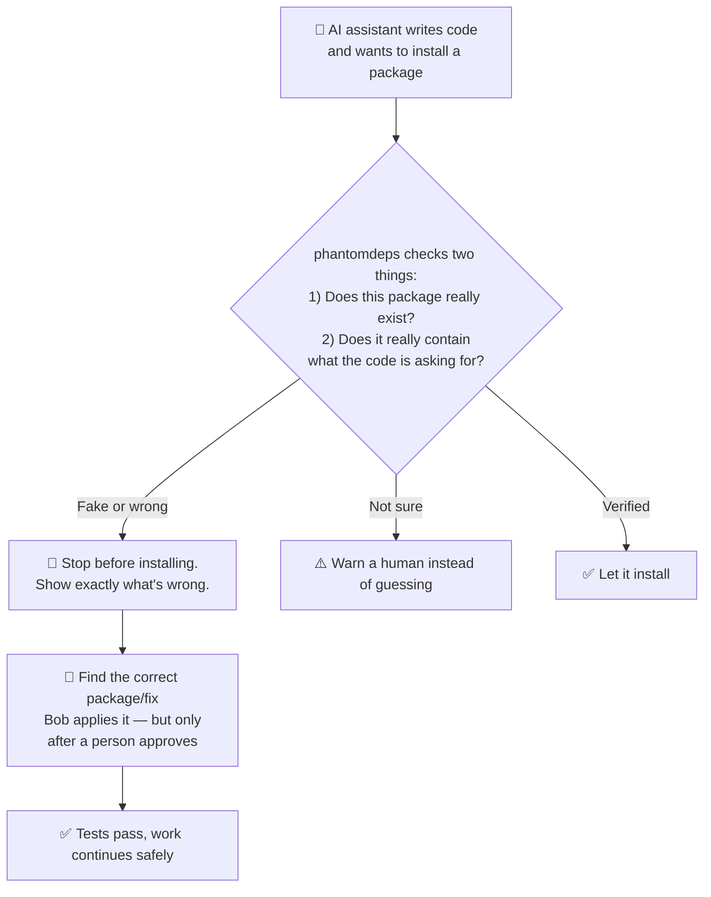
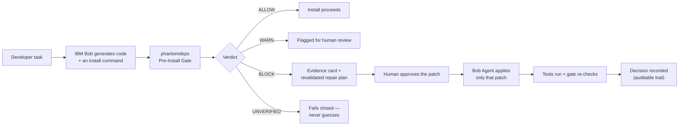
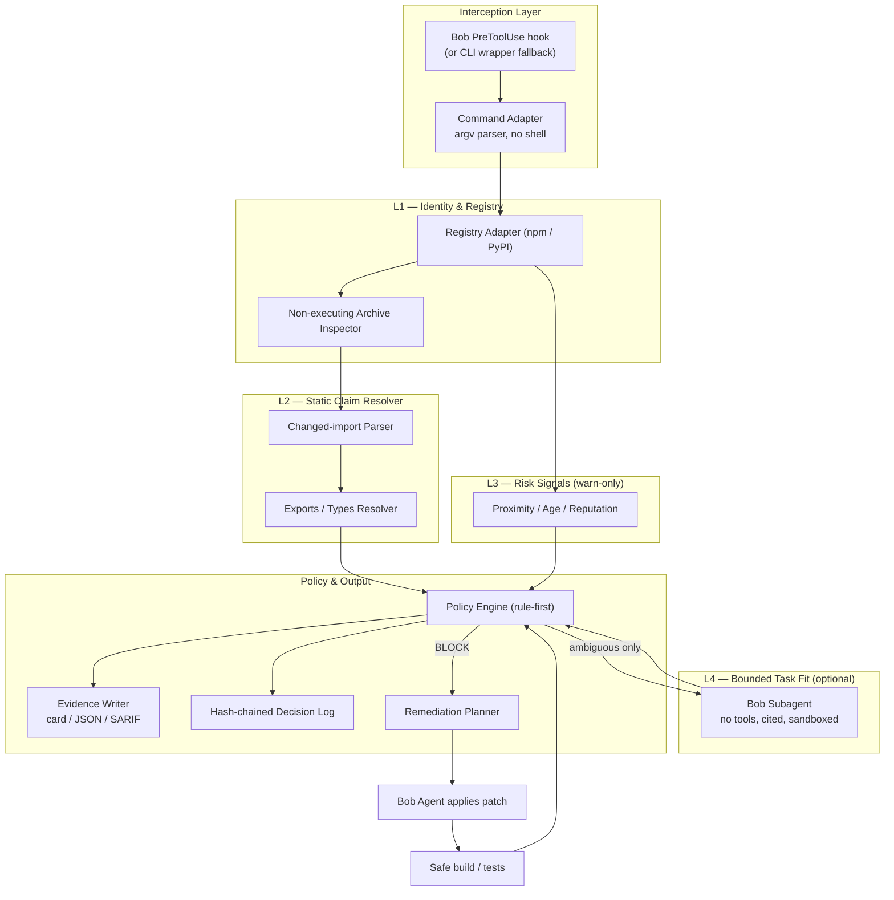
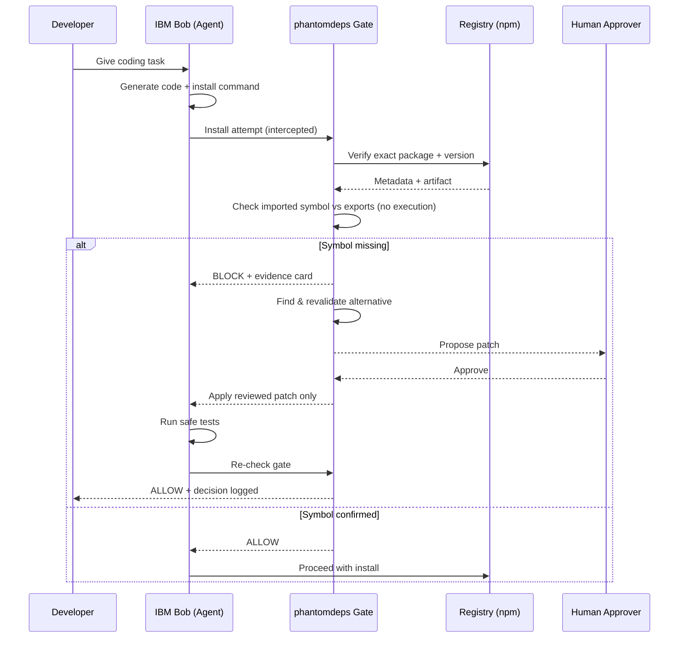
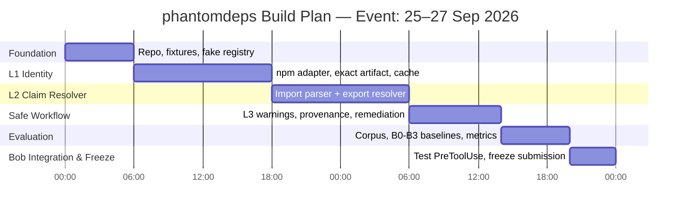
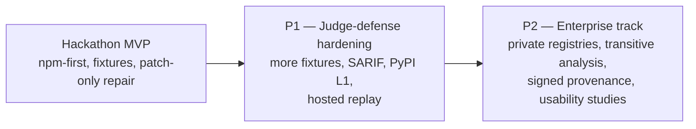
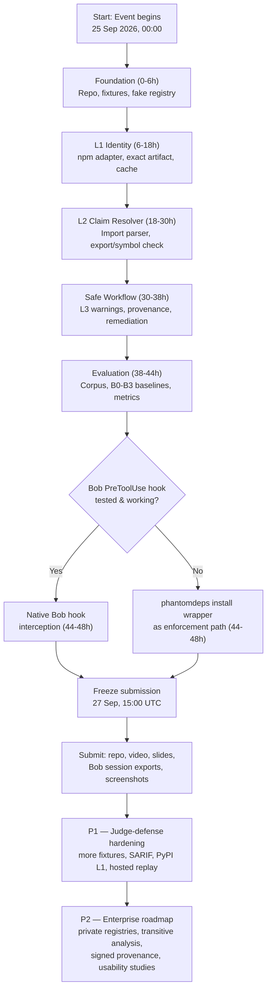
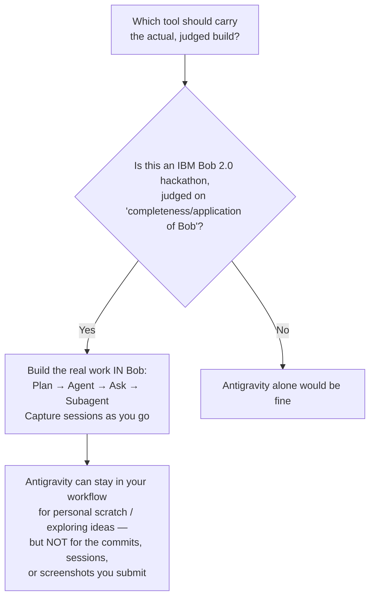

# phantomdeps — Project Reference: Conversation Log + Visual Explainer

*A single reference document combining the questions asked, the answers given, the full visual explainer, and a few extra Q&As your team is likely to hit next.*

---

## Part 1 — Conversation Log

### Q1. "Check it carefully and drop the brief of the project along with basic description, 5 different examples that how user can use our product and how it's really work"

**A1.**

**phantomdeps is a pre-install "claim gate" for AI coding agents, built for the IBM Bob 2.0 hackathon (25–27 Sept 2026).** Before an agent installs a dependency, it checks that the package exists on the right registry and that the API the generated code imports actually exists in that exact version. It then gives Bob cited evidence and a reviewed patch.

Tagline from the research: *"The package exists; the API claim does not, and Bob repairs the claim before install."*

**Why it matters**
- A USENIX Security 2025 study of 16 models found 19.7% of 2.23M package recommendations didn't exist (205,474 unique fake names).
- Lasso's harmless test package got 30,000+ real downloads in 3 months after AI-propagated instructions used the wrong name.
- Existing tools check names or reputation. Few check whether the *symbol* the code imports is real.

**How it works**
- **Intercept:** parses `npm install x` safely, with no shell. It runs through Bob's `PreToolUse` hook or a `phantomdeps install` wrapper.
- **Identity check:** looks up the exact version and artifact hash, and separates "404" from "registry down."
- **API check:** reads the package archive without running any code and looks for the imported symbol in its exports and types.
- **Optional task fit:** a no-tools Bob subagent reads the README, treated as untrusted, to judge whether the package fits the task.
- **Verdict:** rule-based `ALLOW / WARN / BLOCK / UNVERIFIED`, with an evidence card and a hash-chained decision log.
- **Repair:** a revalidated alternative becomes a patch. A human approves, Bob Agent applies it, tests run, and the gate re-checks.

**5 ways to use it**
1. **Invented package.** The agent runs `npm install acme-json-fixer` (a made-up name). The registry returns 404, so it's blocked before anything runs. If the name exists only on PyPI, the result is `BLOCK WRONG_ECOSYSTEM`.
2. **Real package, made-up function (the flagship demo).** Bob writes `import { autoRetry } from "some-lib"`. A name check passes, but phantomdeps finds no such export in that version and blocks with a citation. It proposes a verified alternative, you approve, Bob patches it, tests go green, and the gate re-checks.
3. **Legitimate but young or dynamic package.** A new but valid library gets `WARN`. Exports it can't statically resolve get `UNVERIFIED`. Neither is a hard block, so you're not punished for using new tools.
4. **CI gate on a PR.** A platform engineer runs `phantomdeps gate --fail-on block --sarif out.sarif`. Exit codes are 0 allow, 1 warn, 2 block, 3 unverified, and findings show up in code scanning.
5. **Outage, override, and audit.** If the registry is down, the result is `UNVERIFIED` and agent/CI mode fails closed. Only a human can override, and they must give a reason. Each decision is logged with rule IDs, artifact hash, and policy hash. Bob's Ask mode can explain any decision from `phantomdeps why`.

**Check these before you present**
- **Nothing is built yet.** The research covers seven Markdown files with no code, tests, or results. Everything above is designed behavior, and the targets (95% recall, <1% false blocks, p50 <800ms) are unmeasured.
- **The hook design was wrong.** Bob's hook is `PreToolUse`, and its stdout is ignored, so the evidence card can't come back as a tool result. Write it to a file or use the wrapper fallback.
- **Drop these claims:** "31.2% fake packages," "~5,000 attacks / 80% credential theft," and "Socket coined slopsquatting." Don't say "first" or "unique" either, since slopcheck, npq, Socket, and Aikido already gate installs. Your edge is symbol-level verification plus repair.
- **Keep scope narrow:** npm-first and registry-name installs only. PyPI is L1-only.
- **Deadline:** submission closed at 27 Sept 15:00 UTC on the live event page, so recheck it.

---

### Q2. "our team use antigravity ide most of the time to create anything for ai assisted coding, so my question is that can we use antigravity ide for building the prototype or we have to use ibm bob ai cause u already know that it is ibm bob 2.0 hackathon??"

**A2.**

**No — build the actual prototype in IBM Bob, not Antigravity.** Antigravity is a solid everyday AI-coding tool, but this is specifically the **IBM Bob 2.0 hackathon**: judging explicitly covers "completeness/application of Bob," and the submission requires Bob task-session screenshots plus Bob-assisted files as evidence. A prototype built mainly in Antigravity leaves no Bob session trail for a judge to verify — even if the code works, you'd have nothing to prove Bob did the work.

Antigravity still has a place in your workflow: use it for personal scratch work, spiking an idea, or drafting something you intend to redo inside Bob. But the commits, sessions, and artifacts you actually submit need to come from Bob's Plan / Agent / Ask / Subagent modes, captured as you go rather than reconstructed at the end.

See the **Roadmap Path** diagram (2.7) in Part 2 for exactly where Bob sits at each stage of the build, and the **Team & Tool Strategy** diagram (2.8) for how to split that work across your team.

---

## Part 2 — Visual Explainer

*Diagrams for every audience: normal people, professionals, engineers, and your team.*

### 2.1 For Normal People (no jargon)

Think of it like a bouncer checking ID **before** letting an AI-written line of code install something.

**Plain-language line:** *"The package exists, but the function the AI wrote doesn't — so we catch that before anything installs, and Bob fixes it for you."*

---

### 2.2 Professional / Product Explainer

**One-line pitch:** *phantomdeps is a deterministic-first claim gate — it verifies the package and the exact API an agent's code claims to use, before install, then hands IBM Bob a cited, reviewable repair.*

---

### 2.3 Technical Stack / Architecture

**Stack notes:** TypeScript/Node CLI, npm registry adapter (PyPI is L1-only in v1), no code execution anywhere — only byte-level archive inspection and static parsing.

---

### 2.4 Actual End-to-End Workflow

---

### 2.5 48-Hour Build Roadmap (the hackathon window)

**Stop conditions built into this plan:** if a fixture can't drive a verdict without a real install, fix the harness first. If L2 can't tell "absent" from "unsupported," downgrade to `UNVERIFIED` instead of a false block. Never let the Bob hook test block the whole project — the wrapper is the fallback.

---

### 2.6 Post-Hackathon Roadmap

---

### 2.7 Roadmap Path — the single path from kickoff to post-hackathon

This is the 48-hour build and the post-hackathon plan drawn as **one path**, including the fork where the team decides between the native Bob hook and the wrapper fallback.

**Reading the fork:** whichever branch the hook test takes, both paths converge back to the same freeze/submit/post-hackathon path — the hook is an enhancement, never a blocker for the rest of the plan.

---

### 2.8 Team & Tool Strategy — Bob vs. Antigravity

**Direct answer:** build the prototype **in Bob**, not in Antigravity-then-port-to-Bob-for-testing. The event explicitly judges "completeness/application of Bob" and requires Bob task-session screenshots plus Bob-assisted files as submission evidence. Work done in Antigravity leaves no Bob session trail — a judge can't verify it, and you'd be reconstructing "Bob evidence" after the fact, which the research explicitly flags as weak.

**Suggested task split** (mapped to the B1–B8 plan above), matched to a 4-person team with 3 beginners (4–5 prototypes each) and 1 first-timer:

| Task | Bob mode | Good fit |
|---|---|---|
| B1 — Plan the npm-first scope & threat boundary | Plan | Most experienced beginner |
| B2 — Scaffold repo, schemas, fixtures | Agent | Any beginner |
| B3 — L1 identity/registry adapter | Agent | Beginner comfortable with APIs |
| B4 — L2 static claim resolver (hardest part) | Agent | Most experienced beginner |
| B5 — Explain one block from evidence | Ask | **First-timer** — read-only, no risk, real Bob evidence |
| B6 — Bounded task-fit subagent / corpus slices | Subagent, parallel | Beginner |
| B7 — Apply reviewed patch, run safe tests | Agent | Beginner |
| B8 — CI, SARIF, submission hygiene | Agent | **First-timer** — low-risk, teaches the whole pipeline |

Putting the first-timer on B5 and B8 gives them genuine, judgeable Bob artifacts (an Ask transcript and a clean CI/submission commit) without needing to write the hardest resolver logic — good for building confidence while still contributing real, evidenced work.

---

## Part 3 — More Questions You'll Probably Ask Next

### Q3. "What's our 30-second elevator pitch if a judge only gives us half a minute?"

**A3.** Use the research's built-in beat sheet:
- **0:00–0:08:** "The agent is about to install a package that exists, so a name check passes."
- **0:08–0:18:** Run the offline gate. Card shows `BLOCK: exact requested symbol absent`, with evidence source and decision ID. "The package exists; the code's API claim does not."
- **0:18–0:30:** Show the revalidated patch and green tests. "Bob applies the reviewed repair. phantomdeps turns a risky install into a cited, tested continuation."

Memory sentence for judges: **"The package exists; the API claim does not — and Bob repairs the claim before install."**

### Q4. "What's the single most important thing to build first, hour zero?"

**A4.** The repo, license, TypeScript scaffold, a **fake registry** and **fake package manager**, and one offline fixture — in that order. The stop condition is explicit in the plan: if a fixture can't drive a deterministic verdict without touching real npm, fix the harness before adding any registry features. Everything else (L1, L2, remediation) depends on this harness existing first.

### Q5. "How do we actually prove Bob did the work, not just us typing into an editor?"

**A5.** Capture evidence as you go, per task, not at the end:
- Plan mode → export the approved plan file.
- Agent mode → commit messages tagged like `feat(L2): static claim resolver [Bob B4]`, plus session summaries and test logs.
- Ask mode → a read-only transcript explaining one blocked case, with citations.
- Subagent/parallel → the exact input given, the approval step, and the output — with no shell/install/network tools attached.
- Agent remediation → before/after diff plus the decision ID it links to.

A screenshot proves Bob was used; it doesn't prove the gate is correct. Keep both: Bob session evidence *and* your own `reports/evaluation.json`.

### Q6. "What should we absolutely NOT claim in the demo or slides?"

**A6.**
- Don't say "universal AI supply-chain firewall" — the scope is npm-first, registry-name installs only.
- Don't say "first" or "market-first" — slopcheck, npq, Socket, and Aikido already do pre-install checks; your edge is the changed-import/API claim plus repair, not interception itself.
- Don't present any metric (recall, false-block rate, latency) that isn't backed by a file under `reports/`. If it's not measured yet, label it `TARGET`.
- Don't call a malicious-but-API-matching package "caught" — that's an explicit, disclosed gap (residual risk #1 in the limitations list).
- Don't claim PyPI parity — v1 only does PyPI L1 (identity), not API/export verification.

### Q7. "If we're running out of time, what's the one thing we cut last?"

**A7.** Cut in this order, keeping the core demo intact as long as possible:
1. L4 (bounded Bob task-fit judgment) — make it a feature flag, off by default.
2. L3 warning signals (age/proximity/reputation) — nice-to-have context, not core.
3. SARIF output — JSON evidence alone is enough for the demo.
4. PyPI support entirely — stay npm-only.
5. **Never cut:** the fake registry/fake package manager safety boundary, or the one real-package/wrong-symbol fixture — that pairing *is* the demo.

