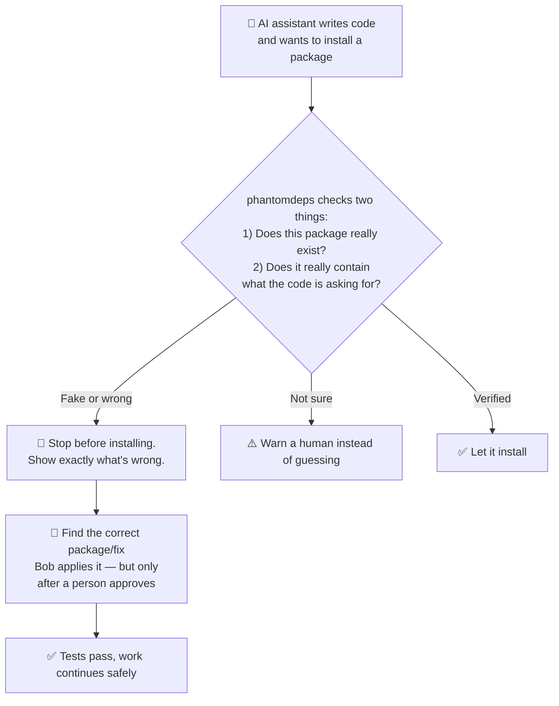
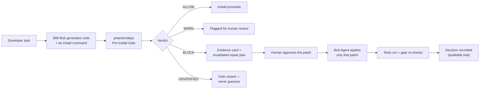
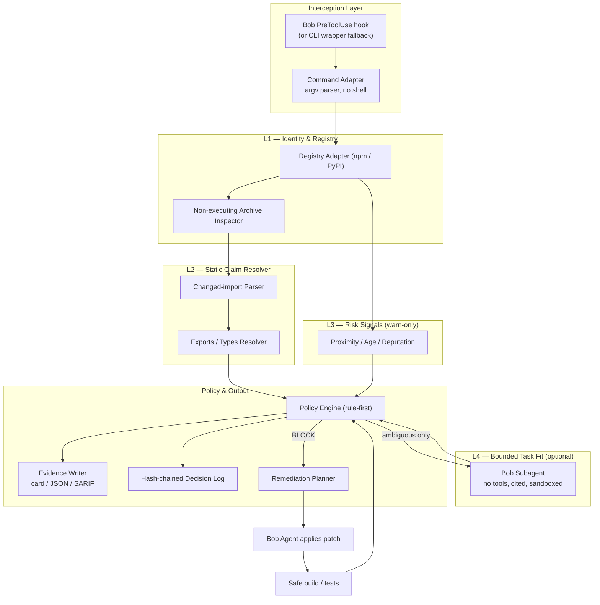
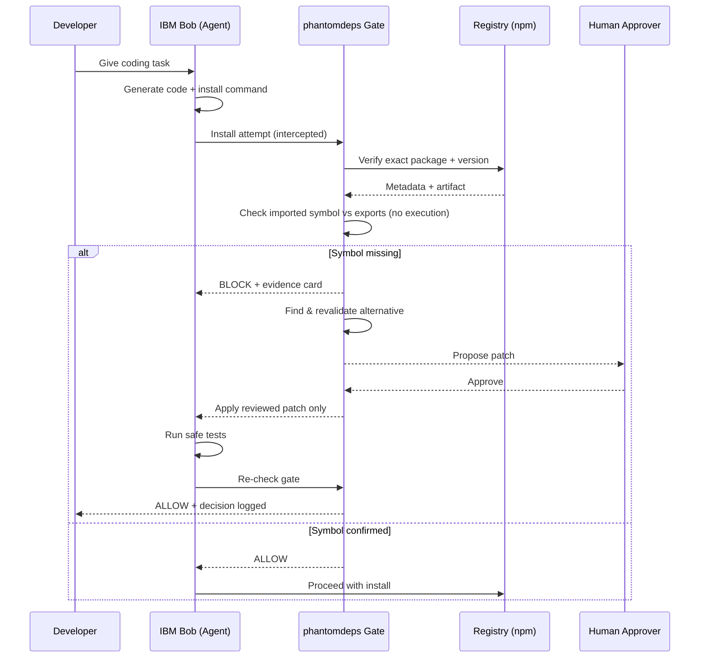

# `phantomdeps`

> **Pre-install AI dependency claim gate for IBM Bob**

[](https://github.com/adishxm/phantomdeps/actions/workflows/ci.yml)


`phantomdeps` is an npm-first, **verification-only** pre-install claim gate. It never installs or executes package code. Its offline fixture path provides a deterministic BLOCK/WARN/ALLOW demo against version-pinned snapshots. In live mode it resolves npm registry metadata and performs live exact-artifact static AST inspection of tarball exports without executing package code. The IBM Bob `PreToolUse` hook intercepts install tool requests with fail-closed argv tokenizing and multi-package aggregation.

---

## Why it exists

AI coding agents hallucinate package names and symbols. A [USENIX Security 2025 study](https://www.usenix.org/conference/usenixsecurity25) found a **19.7% package-level hallucination rate** across 2.23 million recommendations from 16 models.

Name-existence checks miss the harder case: a real package that simply does not export the symbol the agent's code imports. `phantomdeps` catches that gap.

> **Key V1 Security Features (Phase 14 Release):**
> - **Exact Tarball Inspection:** Statically inspects package tarball exports (ESM `exports` and TypeScript `.d.ts` AST declarations) without code execution.
> - **Fail-Closed Hook Guard:** IBM Bob `PreToolUse` hook uses an argv tokenizer, multi-package aggregation, and strict-agent UNVERIFIED -> exit 2 rules.
> - **Tamper-Evident Audit Log:** SHA-256 hash-chained log verified via `phantomdeps audit-log verify`.
> - **Explicit Claim Context:** Symbol context resolved via `--symbols`, `--diff` (git diff import extraction), or `--file`. Missing context returns `UNVERIFIED`.
> - **Verification-Only:** `install`/`add` are aliases for `check`/`verify` — no package is ever installed or executed.

```
IBM Bob: "import { isOddBatch } from 'is-odd'"   ← hallucinated symbol
phantomdeps: BLOCK — is-odd@3.0.1 exports isOdd(), not isOddBatch
```

---

## Quick start

```bash
git clone https://github.com/adishxm/phantomdeps.git
cd phantomdeps
npm install
npm test                                      # 205/205 tests pass
npx tsx src/cli.ts demo --fixture --offline   # live BLOCK demo
```

---

## Demo scenarios

Three built-in offline scenarios — no network, no package installation:

```bash
# BLOCK — hallucinated symbol (isOddBatch does not exist in is-odd)
npx tsx src/cli.ts demo --fixture --offline --scenario block

# ALLOW — real package, symbol confirmed present (lodash.merge)
npx tsx src/cli.ts demo --fixture --offline --scenario allow

# WARN  — real package, but has install scripts (supply-chain risk)
npx tsx src/cli.ts demo --fixture --offline --scenario warn
```

| Scenario | Package | Verdict | Exit |
|---|---|---|---|
| `block` (default) | `is-odd@3.0.1` — `isOddBatch` absent | **BLOCK** | `2` |
| `allow` | `lodash@4.17.21` — `merge` confirmed | **ALLOW** | `0` |
| `warn` | `risky-new-pkg` — install scripts present | **WARN** | `1` |

---

## Verified output

Confirmed on macOS / Node.js v26.8.1 — Phase 14 Release Candidate.

### `npm test`

```
 PASS  tests/gate-integration.test.ts
 PASS  tests/artifact-registry.test.ts
 PASS  tests/parser.test.ts
 PASS  tests/audit-log.test.ts
 PASS  tests/static-claim.test.ts
 PASS  tests/claim-context.test.ts
 PASS  tests/fixture-loader.test.ts
 PASS  tests/policy.test.ts
 PASS  tests/edge-cases.test.ts
 PASS  tests/hook-subprocess.test.ts

Test Suites: 10 passed, 10 total
Tests:       205 passed, 205 total
Time:        ~6.3 s
```


### `npx tsx src/cli.ts demo --fixture --offline`

```
phantomdeps — pre-install AI dependency claim gate
Offline fixture demo — no network calls, no package installation

[SCENARIO]
  IBM Bob generated code that imports a function from an npm package.
  Bob is about to run: npm install is-odd
  The generated code uses: import { isOddBatch } from 'is-odd'
  phantomdeps intercepts the install command and checks the claim...

[FIXTURE] Loaded: is-odd-demo — captured 2025-09-20T00:00:00.000Z

────────────────────────────────────────────────────────────
phantomdeps gate — BLOCK
────────────────────────────────────────────────────────────
  Package  : is-odd@3.0.1 → 3.0.1
  Ecosystem: npm
  Source   : fixture (fixture://is-odd-demo)
  Integrity: sha512-sSqAd7...
  Decision : f19b0b40-fe5b-4d05-be96-5e1ad70f7a8e

Findings:
  ✖ [l2.symbol_missing]
    BLOCK: Symbol(s) [isOddBatch] are NOT present in the declared exports of is-odd@3.0.1.
    The AI-generated import claims a symbol that this package does not export.

  Record hash : sha256:f3588ad683808cf632acf7b82cf49f278d015c224ded58427ea7d23b3c3fa4ca
────────────────────────────────────────────────────────────

[REMEDIATION]
  The symbol 'isOddBatch' does not exist in is-odd@3.0.1.
  The correct exported function is: isOdd(n)
  Suggested patch (requires human approval before application):
    - import { isOddBatch } from 'is-odd'
    + import isOdd from 'is-odd'

  No package was installed. No code was executed.
  Decision record appended to .phantomdeps/decisions.ndjson

✔ Demo completed. Verdict: BLOCK (expected: BLOCK)
```

---

## Commands

```bash
# Offline fixture demo (default: BLOCK scenario)
npx tsx src/cli.ts demo --fixture --offline

# Offline demo — choose scenario
npx tsx src/cli.ts demo --fixture --offline --scenario allow
npx tsx src/cli.ts demo --fixture --offline --scenario warn

# Check / verify a package against live registry
npx tsx src/cli.ts verify lodash@4.17.21 --symbols merge,cloneDeep

# Machine-readable JSON output (Phase 13)
npx tsx src/cli.ts verify lodash@4.17.21 --symbols merge --json

# Verify from diff context — only newly added imports are checked (Phase 13)
npx tsx src/cli.ts verify lodash@4.17.21 --symbols merge --diff changes.diff

# Verify the tamper-evident audit log (Phase 12)
npx tsx src/cli.ts audit-log verify
npx tsx src/cli.ts audit-log verify /path/to/decisions.ndjson

# 'install' and 'add' are verification-only aliases (Phase 13 — do NOT run npm install)
npx tsx src/cli.ts install is-odd --symbols isOddBatch
```

**Exit codes (check/verify/install commands):** `0` = ALLOW · `1` = WARN · `2` = BLOCK · `3` = UNVERIFIED
**Exit code (demo command):** always `0` when the demo verdict matches the expected verdict.
**Exit code (audit-log verify):** `0` = clean · `2` = violations detected.

> **Phase 12 note:** The decision log is **tamper-evident after verification**, not immutable.
> Run `audit-log verify` to validate hash chain integrity, record hashes, ordering, and schema.
> A passing verification means no detectable tampering occurred — it does not make the log append-only.

---

## How it works

```
npm install <pkg>
    ↓
CommandAdapter     — parses argv without shell evaluation; rejects metacharacters
    ↓
RegistryAdapter    — resolves exact version + integrity from npm registry (L1)
    ↓
StaticClaimChecker — checks declared exports against imported symbols (L2)
    ↓
RiskSignals        — warning-only: install scripts, young package, artifact integrity unavailable (L3)
    ↓
PolicyEngine       — rule-first ALLOW / WARN / BLOCK / UNVERIFIED
    ↓
EvidenceWriter     — terminal card + hash-chained NDJSON decision log
```

No package code is ever executed. Offline fixture mode uses version-pinned snapshots.

---

## Visual Architecture & Workflow

### 1. Intuitive View (High-Level Concept)

Think of `phantomdeps` like an ID verification gate **before** letting an AI-written line of code install or execute unknown packages:



> **Plain-language summary:** *"The package exists, but the function the AI wrote doesn't — so phantomdeps catches that before anything installs, and IBM Bob fixes it for you."*

### 2. Product Decision Flow



### 3. Technical Stack & Layered Architecture



### 4. End-to-End Interception & Remediation Workflow



---

## Verdict semantics

| Verdict | Meaning |
|---|---|
| `ALLOW` | Required checks passed; no hard finding |
| `WARN` | Weak signal or bounded ambiguity (install scripts, young package) |
| `BLOCK` | High-confidence claim failure — 404, wrong ecosystem, symbol absent |
| `UNVERIFIED` | Network/cache/parser prevented a reliable decision — **never silently converted to ALLOW** |

---

## Project structure

```
phantomdeps/
├── src/
│   ├── cli.ts                   — CLI entry point + command routing (check, verify, demo, audit-log)
│   ├── gate.ts                  — pipeline orchestrator (combines L1–L3 + claim context)
│   ├── parser.ts                — safe argv tokenizer & flag stripper (replaces regex parser)
│   ├── diff-parser.ts           — git diff / file import extractor (explicit claim context)
│   ├── capture-fixture.ts       — live registry fixture recorder utility
│   ├── types.ts                 — core domain types, verdict enums, evidence contracts
│   ├── adapters/
│   │   ├── registry.ts          — npm registry packument/metadata resolver (L1)
│   │   └── artifact.ts          — tarball fetcher, integrity checker & static AST export resolver (L2)
│   ├── checker/
│   │   ├── static-claim.ts      — AST symbol resolution against package exports (L2)
│   │   └── risk-signals.ts      — install script detection, young package, integrity checks (L3)
│   ├── engine/
│   │   └── policy.ts            — deterministic rule-first verdict engine (ALLOW/WARN/BLOCK/UNVERIFIED)
│   ├── evidence/
│   │   └── writer.ts            — terminal card formatter, JSON emitter & hash-chained log writer
│   ├── demo/
│   │   └── runner.ts            — multi-scenario offline fixture demo runner
│   └── fixtures/
│       └── loader.ts            — offline fixture loader and validator
│
├── tests/                       — 10 comprehensive test suites (205 tests total)
│   ├── parser.test.ts           — argv tokenizer, option-first, flags, length limits
│   ├── static-claim.test.ts     — symbol resolution against exports
│   ├── policy.test.ts           — rule-first policy engine logic
│   ├── fixture-loader.test.ts   — offline fixture schema & loader tests
│   ├── gate-integration.test.ts — full gate pipeline integration tests
│   ├── edge-cases.test.ts       — adversarial inputs, protocol injection, malformed specs
│   ├── artifact-registry.test.ts— tarball download, integrity verification, AST parsing
│   ├── audit-log.test.ts        — hash chain verification, tamper detection, override records
│   ├── claim-context.test.ts    — diff parsing, symbol contracts, missing context handling
│   └── hook-subprocess.test.ts  — live PreToolUse.mjs subprocess execution & fail-closed tests
│
├── eval/                        — evaluation corpus & empirical measurement
│   ├── corpus.json              — 15 version-pinned test cases (B0 baseline, B1 metadata, B2 API)
│   ├── run-evaluation.ts        — automated benchmark runner measuring recall, precision, latency
│   └── results.json             — empirical benchmark results (100% recall, 0% false block)
│
├── fixtures/                    — version-pinned offline demo fixtures
│   ├── is-odd-demo.json         — is-odd@3.0.1: real package, absent symbol → BLOCK
│   ├── lodash-allow-demo.json   — lodash@4.17.21: real package, symbol present → ALLOW
│   └── risky-new-pkg-warn-demo.json — package with install scripts → WARN
│
├── docs/                        — technical documentation
│   └── product-contract.md      — frozen product contract, verification boundary, CLI semantics
│
├── .bob/                        — IBM Bob integration
│   ├── hooks/
│   │   └── PreToolUse.mjs       — PreToolUse hook (argv tokenizer, strict-agent, exit 2 = BLOCK)
│   └── settings.json            — Bob hook configuration
│
├── .phantomdeps/                — runtime state & audit trail
│   ├── decisions.ndjson         — SHA-256 hash-chained decision audit log
│   └── hook-info.json           — hook runtime registration metadata
│
├── .brain/                      — architectural records & planning
│   ├── .imple-plan/             — synchronized phase implementation plans (Phases 00–14)
│   │   ├── 00-roadmap-index.md  — roadmap index (Phases 00–14)
│   │   ├── active-remediation-roadmap.md — active remediation roadmap
│   │   ├── ibm-bob-roadmap.md   — historical Phase 00–08 baseline
│   │   └── phase-00-implementation.md ... phase-14-implementation.md
│   └── .report/                 — phase reports, decision log, risk log, test plan, traceability
│       ├── 00-executive-summary.md — executive summary & gate status
│       ├── research-alignment-ledger.md — capability matrix & research decision gates
│       ├── phase-14-report.md   — independent release gate verification report
│       └── phase-14-release-checklist.md — final release checklist & human stop gate
│
├── .docs/                       — hackathon research & submission assets
│   ├── 01_RESEARCH/             — complete research document, reference log, master prompt
│   └── 10_DEMO/                 — demo script, judge Q&A, pitch, presentation outline
│
└── .github/workflows/
    └── ci.yml                   — GitHub Actions CI: Node 20 + 22 test & lint matrix
```

---

## IBM Bob integration

`phantomdeps` uses IBM Bob throughout the build:

- **Plan mode** — architecture and policy design before coding
- **Agent mode** — implementation, tests, and patch application
- **Ask mode** — explain why a claim was blocked using the evidence file
- **`PreToolUse` hook** — intercepts `execute_command` calls matching `npm install`; exit code `2` blocks the tool

Hook config (`.bob/settings.json`):
```json
{
  "hooks": {
    "PreToolUse": [
      {
        "matcher": "execute_command",
        "command": "npx tsx .bob/hooks/PreToolUse.mjs"
      }
    ]
  }
}
```

> **Note:** Per official IBM Bob docs, `PreToolUse` stdout is ignored. Evidence is written to `.phantomdeps/decisions.ndjson`. Exit code `2` blocks the matched tool.

---

## Capability matrix

| Capability | Status | Notes |
|---|---|---|
| Fixture-mode BLOCK / WARN / ALLOW demo | `implemented` | 3 committed fixtures; deterministic; 103/103 tests |
| npm registry metadata resolution (live mode) | `implemented` | Version pinning, integrity, install-script signal |
| Static symbol verification — fixture path | `implemented` | Against committed fixture `exports` + `claimedSymbols` |
| Static symbol verification — live mode | `implemented` | Phase 11: tarball download + integrity verify + exports_field/declarations inspection; no code execution |
| `UNVERIFIED` verdict (non-blocking ambiguity) | `implemented` | Never silently converted to ALLOW |
| Provenance / publish-date risk signal | `implemented` | Phase 11: `publishedAt` now populated from packument `time` map in live mode |
| IBM Bob `PreToolUse` hook — fixture + live metadata path | `implemented` | Phase 10: argv tokenizer, multi-package, strict UNVERIFIED→exit 2; 28 subprocess tests |
| IBM Bob `PreToolUse` hook — live static symbol check | `planned` | Phase 11 target (tarball inspection) |
| Multi-package command interception | `implemented` | Phase 10: all specs checked; BLOCK propagates fail-closed |
| Option-first installs (`-D`, `--save`, etc.) | `implemented` | Phase 10: flags stripped before spec extraction |
| Shell-metachar / protocol injection rejection | `implemented` | `PROTOCOL_RE`, 214-char limit, metachar guard |
| NDJSON hash-chained decision log | `implemented` | `.phantomdeps/decisions.ndjson`; SHA-256 chain; tamper-evident after `audit-log verify` |
| `audit-log verify` tamper-evidence check | `implemented` | Phase 12: schema, hash, chain, ordering, redaction validation |
| Agent override records | `implemented` | Phase 12: actor, reason, timestamp, commandDigest, resultingPolicy — hash-chained |
| Five-dimensional evidence provenance | `implemented` | Phase 12: artifactIntegrity / registrySignature / provenanceAttestation / publisherIdentity / sourceRepository |
| Claim-context contract (--symbols / diff / file) | `implemented` | Phase 13: missing context → UNVERIFIED; no fixture substitution on live path |
| Import diff parser | `implemented` | Phase 13: only newly added imports parsed from diff/file context |
| Machine-readable --json output | `implemented` | Phase 13: structured JSON output for all check/verify commands |
| Width-aware terminal wrapping | `implemented` | Phase 13: 80/120/240 column-aware output |
| Patch-suggestion remediation | `implemented` | Terminal card only; human approval required; no auto-apply |
| Non-npm ecosystems (pip, cargo, gem, …) | `unsupported` | npm-first only in v1 |
| Transitive dependency analysis | `unsupported` | Not in v1 scope |
| Lock-file / dependency graph analysis | `unsupported` | Not in v1 scope |

---

## Historical baseline — Phases 00–08

The table below records historical baseline work. It is not approval of the current security boundary. Active remediation is tracked in the research-aligned Phase 09–14 roadmap.

| Phase | Status | Key deliverables |
|---|---|---|
| 00 — Intake & audit | ✅ **PASSED** | Repo initialized, scaffold verified, MVP selected, pushed to GitHub |
| 01 — Product contract | ✅ **PASSED** | 8 user stories, 10 ACs, 14 requirements mapped, 6 contradictions resolved |
| 02 — Architecture & design | ✅ **PASSED** | Architecture, data model, UX flows, threat model, CI plan documented |
| 03 — Build MVP | ✅ **PASSED** | CI pipeline, **35/35 tests**, BLOCK + WARN + ALLOW confirmed, 3 fixtures, hook wired |
| 04 — Local validation | ✅ **PASSED** | Lint clean, 35/35 tests, AC-01–09 verified, NDJSON log bug fixed, evidence recorded |
| 05 — Advanced validation | ✅ **PASSED** | 68 new tests (103 total), 2 parser fixes, 0 vulns, avg 1168ms offline |
| 06 — Outsider review | ✅ **PASSED** | 2 blocking findings fixed (hook TS syntax, missing settings.json), hook verified |
| 07 — Finalization & demo | ✅ **PASSED** | RC tag v0.1.0-rc.1, demo script finalized, judge Q&A, rehearsal 7/7 PASS |
| 08 — Submission package | ✅ **PASSED** | Secret scan clean, 59-item checklist, stop gate enforced |

---

## Active research-aligned remediation

- [Active remediation roadmap](.brain/.imple-plan/active-remediation-roadmap.md)
- [Secondary agent remediation lane](.brain/.imple-plan/agent-remediation-roadmap.md)
- [IBM Bob remediation lane](.brain/.imple-plan/ibm-bob-remediation-roadmap.md)
- [Research-alignment capability ledger](.brain/.report/research-alignment-ledger.md)
- [Current Phase 14 release checklist](.brain/.report/phase-14-release-checklist.md)

## Research and historical planning

- Full research report: [`.docs/01_RESEARCH/IBM_Bob2_Phantomdeps_Complete_Research.md`](.docs/01_RESEARCH/IBM_Bob2_Phantomdeps_Complete_Research.md)
- Historical Phase 00–08 roadmap: [`.brain/.imple-plan/ibm-bob-roadmap.md`](.brain/.imple-plan/ibm-bob-roadmap.md)
- Decision log: [`.brain/.report/decision-log.md`](.brain/.report/decision-log.md)
- Phase 00 report: [`.brain/.report/phase-00-report.md`](.brain/.report/phase-00-report.md)
- Phase 01 report: [`.brain/.report/phase-01-report.md`](.brain/.report/phase-01-report.md)
- Phase 02 report: [`.brain/.report/phase-02-report.md`](.brain/.report/phase-02-report.md)
- Phase 03 report: [`.brain/.report/phase-03-report.md`](.brain/.report/phase-03-report.md)
- Phase 04 report: [`.brain/.report/phase-04-report.md`](.brain/.report/phase-04-report.md)
- Phase 05 report: [`.brain/.report/phase-05-report.md`](.brain/.report/phase-05-report.md)
- Phase 06 report: [`.brain/.report/phase-06-report.md`](.brain/.report/phase-06-report.md)
- Phase 07 report: [`.brain/.report/phase-07-report.md`](.brain/.report/phase-07-report.md)
- Phase 08 report: [`.brain/.report/phase-08-report.md`](.brain/.report/phase-08-report.md)


---

## Contributors

- [Aditya Kumar Sharma](https://github.com/adishxm) — product, architecture, demo, PPT
- [Narayan Kumar Jha](mailto:narayan.nkj@gmail.com) — implementation, tests
- [Utkarsh Yadav](https://github.com/utkarsh-2207) — validation, security, IBM Bob workflow
- [Roshan Singh](https://github.com/rs3260821-dotcom) — contributor


---

## License

MIT — see [LICENSE](LICENSE)
