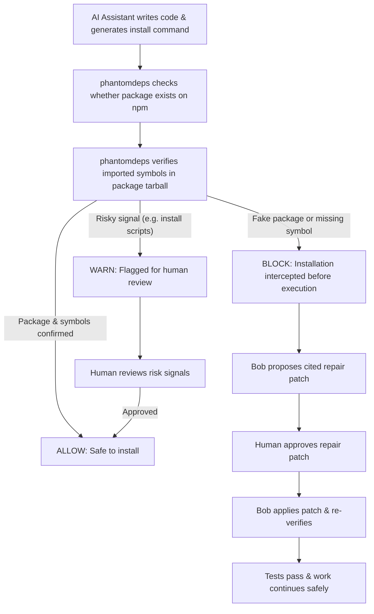
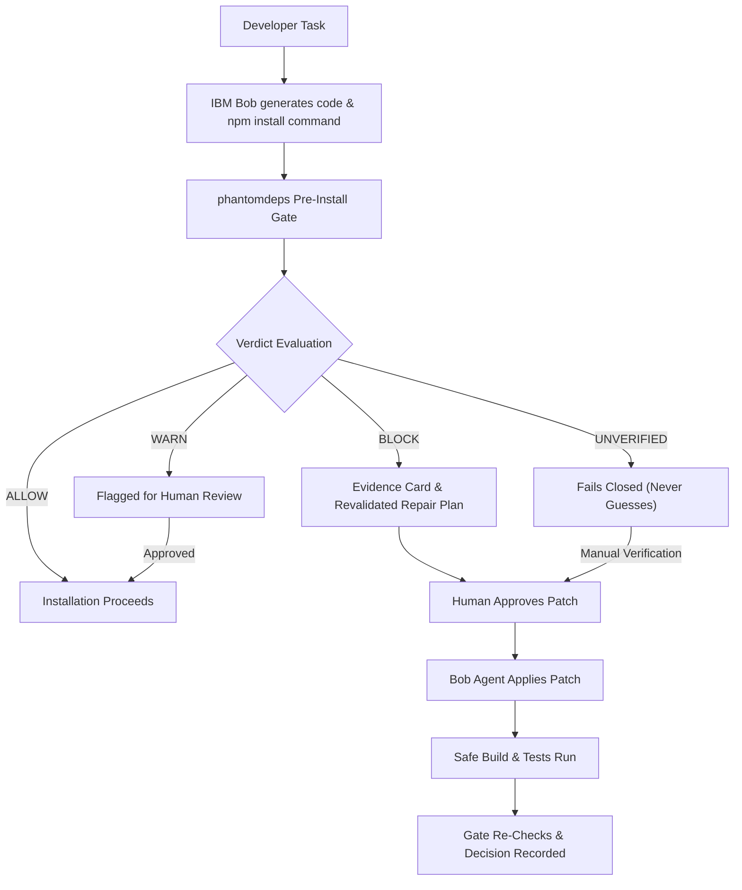
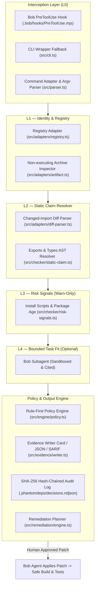
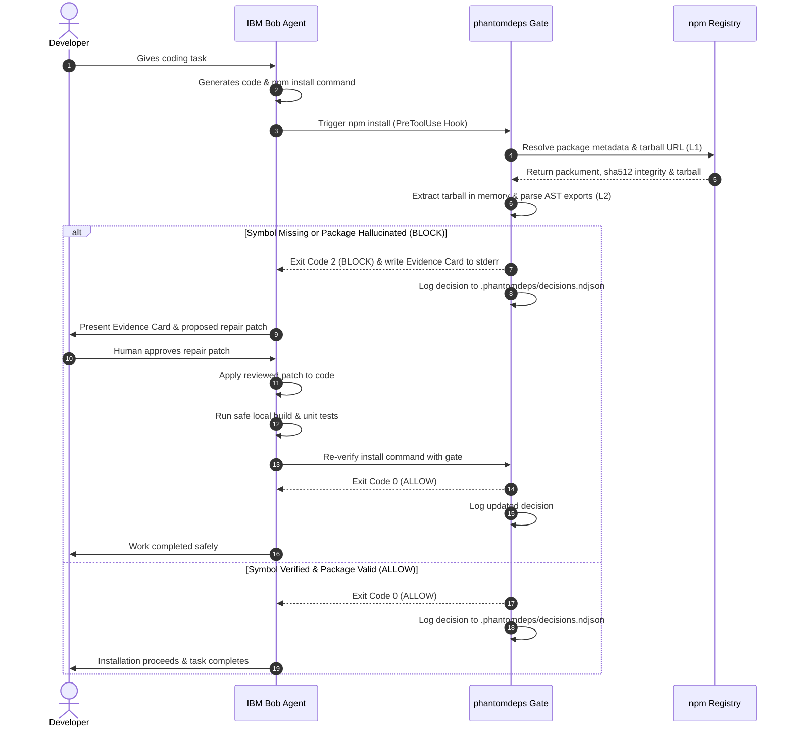

<div align="center">

# phantomdeps

### Pre-install AI dependency claim gate for IBM Bob

[](https://github.com/adishxm/phantomdeps/actions/workflows/ci.yml)


<p align="center">
  <b>phantomdeps</b> is an npm-first, <b>verification-only</b> pre-install claim gate designed to prevent AI coding agent package and symbol hallucinations. It statically verifies exported AST declarations from npm tarballs without executing target package code.
</p>

</div>

---

## Table of Contents

- [Overview](#overview)
- [Plain-Language Workflow](#plain-language-workflow)
- [Product Workflow & Explainer](#product-workflow--explainer)
- [Technical Architecture](#technical-architecture)
- [End-to-End Sequence Flow](#end-to-end-sequence-flow)
- [Key Features](#key-features)
- [Quick Start](#quick-start)
- [Demo Scenarios](#demo-scenarios)
- [Verified Output Example](#verified-output-example)
- [Usage & CLI Commands](#usage--cli-commands)
- [Project Structure](#project-structure)
- [IBM Bob Integration](#ibm-bob-integration)
- [Security, Provenance & Audit Logging](#security-provenance--audit-logging)
- [Testing & Quality Assurance](#testing--quality-assurance)
- [Git History & Milestone Timeline](#git-history--milestone-timeline)
- [Product Contract & Scope Boundaries](#product-contract--scope-boundaries)
- [Team & Contribution](#team--contribution)
- [License & Acknowledgments](#license--acknowledgments)

---

## Overview

AI coding agents frequently recommend non-existent packages or hallucinate function exports from real packages. A [USENIX Security 2025 study](https://www.usenix.org/conference/usenixsecurity25) found a **19.7% package-level hallucination rate** across 2.23 million recommendations from 16 popular LLMs.

Standard name-existence checks miss the critical gap: a real package that exists on npm, but does **not** export the specific function or symbol claimed in the AI-generated import. `phantomdeps` bridges this gap before `npm install` executes.

```typescript
// AI Agent generates:
import { isOddBatch } from 'is-odd'; // Hallucinated symbol!

// phantomdeps gate intercepts:
// Verdict: BLOCK — is-odd@3.0.1 exports isOdd(n), not isOddBatch
```

> [!IMPORTANT]
> **Verification-Only Guarantee**: `phantomdeps` never calls `npm install`, never imports third-party modules, and never executes package code or lifecycle scripts (`preinstall`/`postinstall`).

---

## Plain-Language Workflow

For developers and non-technical readers, `phantomdeps` acts as an automated safety check between an AI assistant and package installation.



> *"The package exists, but the function the AI wrote doesn't — so we catch that before anything installs, and Bob fixes it for you."*

---

## Product Workflow & Explainer

How `phantomdeps` evaluates AI tool invocations, returns deterministic policy decisions, and integrates into agent workflows.



> *"phantomdeps is a deterministic-first claim gate — it verifies the package and the exact API an agent's code claims to use, before install, then hands IBM Bob a cited, reviewable repair."*

---

## Technical Architecture

The multi-layered verification pipeline architecture powering `phantomdeps`.



> *"TypeScript/Node CLI, npm registry adapter (PyPI is L1-only in v1), no code execution anywhere — only byte-level archive inspection and static parsing."*

---

## End-to-End Sequence Flow

Sequence diagram demonstrating real-time interception, tarball inspection, evidence card generation, and repair approval.



---

## Key Features

- **Static Tarball AST Inspection**: Inspects package tarball exports (`package.json#exports` ESM maps and TypeScript `.d.ts` AST declarations) without executing code.
- **Fail-Closed IBM Bob Hook Guard**: Intercepts `execute_command` requests (`npm install`, `npm add`, `npm i`) with argv whitespace tokenization, flag stripping, and multi-package severity aggregation (`BLOCK` > `UNVERIFIED` > `WARN` > `ALLOW`).
- **Tamper-Evident SHA-256 Audit Log**: Appends decisions to `.phantomdeps/decisions.ndjson` with SHA-256 hash chaining. Verified via `phantomdeps audit-log verify`.
- **Explicit Claim-Context Contract**: Accepts symbol context via `--symbols`, git diff import extraction (`--diff <file>`), or source file inspection (`--file <path>`). Missing context safely returns `UNVERIFIED`.
- **Machine-Readable Output**: Emits structured JSON via `--json` and responsive terminal cards formatted dynamically for 80, 120, or 240 column displays.
- **Human-Approved Remediation**: Suggests import fixes (e.g. replacing `isOddBatch` with `isOdd`) as terminal suggestions requiring explicit human confirmation.

---

## Quick Start

```bash
# Clone the repository
git clone https://github.com/adishxm/phantomdeps.git
cd phantomdeps

# Install dependencies & run build check
npm install
npm run build

# Execute test suite (10 test suites / 205 tests)
npm test

# Run the offline fixture demo (default BLOCK scenario)
npx tsx src/cli.ts demo --fixture --offline
```

---

## Demo Scenarios

`phantomdeps` includes three built-in offline demo scenarios running against committed fixture snapshots without network calls:

```bash
# BLOCK — hallucinated symbol (isOddBatch does not exist in is-odd)
npx tsx src/cli.ts demo --fixture --offline --scenario block

# ALLOW — real package, symbol confirmed present (lodash.merge)
npx tsx src/cli.ts demo --fixture --offline --scenario allow

# WARN  — real package, but has install scripts (supply-chain risk)
npx tsx src/cli.ts demo --fixture --offline --scenario warn
```

| Scenario | Package Target | Claimed Symbol | Verdict | Exit Code |
|---|---|---|---|---|
| `block` (default) | `is-odd@3.0.1` | `isOddBatch` | **BLOCK** | `2` |
| `allow` | `lodash@4.17.21` | `merge` | **ALLOW** | `0` |
| `warn` | `risky-new-pkg` | `initialize` (install script present) | **WARN** | `1` |

---

## Verified Output Example

```text
phantomdeps — pre-install AI dependency claim gate
Offline fixture demo — no network calls, no package installation

[SCENARIO]
  IBM Bob generated code that imports a function from an npm package.
  Bob is about to run: npm install is-odd
  The generated code uses: import { isOddBatch } from 'is-odd'
  phantomdeps intercepts the install command and checks the claim...

[FIXTURE] Loaded: is-odd-demo — captured 2025-09-20T00:00:00.000Z

────────────────────────────────────────────────────────────
phantomdeps gate — BLOCK
────────────────────────────────────────────────────────────
  Package  : is-odd@3.0.1 → 3.0.1
  Ecosystem: npm
  Source   : fixture (fixture://is-odd-demo)
  Integrity: sha512-sSqAd7...
  Decision : f19b0b40-fe5b-4d05-be96-5e1ad70f7a8e

Findings:
  ✖ [l2.symbol_missing]
    BLOCK: Symbol(s) [isOddBatch] are NOT present in the declared exports of is-odd@3.0.1.
    The AI-generated import claims a symbol that this package does not export.

  Record hash : sha256:f3588ad683808cf632acf7b82cf49f278d015c224ded58427ea7d23b3c3fa4ca
────────────────────────────────────────────────────────────

[REMEDIATION]
  The symbol 'isOddBatch' does not exist in is-odd@3.0.1.
  The correct exported function is: isOdd(n)
  Suggested patch (requires human approval before application):
    - import { isOddBatch } from 'is-odd'
    + import isOdd from 'is-odd'

  No package was installed. No code was executed.
  Decision record appended to .phantomdeps/decisions.ndjson

✔ Demo completed. Verdict: BLOCK (expected: BLOCK)
```

---

## Usage & CLI Commands

```bash
# Verify a package against the live npm registry
npx tsx src/cli.ts verify lodash@4.17.21 --symbols merge,cloneDeep

# Machine-readable JSON output
npx tsx src/cli.ts verify lodash@4.17.21 --symbols merge --json

# Verify from a unified git diff file (extracts newly added imports)
npx tsx src/cli.ts verify lodash@4.17.21 --diff changes.diff

# Verify audit log integrity against tampering
npx tsx src/cli.ts audit-log verify
npx tsx src/cli.ts audit-log verify .phantomdeps/decisions.ndjson

# Verification-only aliases (do NOT run npm install)
npx tsx src/cli.ts install is-odd --symbols isOddBatch
npx tsx src/cli.ts add lodash --symbols merge
```

### Command Exit Codes

| Command Type | Exit 0 | Exit 1 | Exit 2 | Exit 3 |
|---|---|---|---|---|
| `verify` / `check` / `install` | `ALLOW` | `WARN` | `BLOCK` | `UNVERIFIED` |
| `demo` | Verdict matched expectation | Verdict mismatched | N/A | N/A |
| `audit-log verify` | Log clean & chain valid | N/A | Tampering / violations detected | N/A |

---

## Project Structure

```text
phantomdeps/
├── src/
│   ├── cli.ts                # Entry point, CLI router & output formatter
│   ├── parser.ts             # Safe argv tokenizer, metacharacter & protocol guard
│   ├── gate.ts               # Core verification gate orchestrator
│   ├── types.ts              # System types, discriminated unions & interfaces
│   ├── capture-fixture.ts    # CLI utility to capture live npm fixtures
│   ├── adapters/
│   │   ├── registry.ts       # Typed npm registry adapter (L1)
│   │   └── artifact.ts       # Safe tarball downloader, extractor & AST inspector (L2)
│   ├── checker/
│   │   ├── static-claim.ts   # Symbol claim resolver & citation generator
│   │   └── risk-signals.ts   # Supply-chain risk detectors (L3)
│   ├── engine/
│   │   └── policy.ts         # Rule-first policy engine (L4)
│   ├── evidence/
│   │   └── writer.ts         # Terminal card renderer & SHA-256 NDJSON log writer
│   ├── fixtures/
│   │   └── loader.ts         # Offline fixture loader
│   └── demo/
│       └── runner.ts         # Offline multi-scenario demo runner
├── fixtures/                 # Version-pinned offline demo JSON fixtures
│   ├── is-odd-demo.json
│   ├── lodash-allow-demo.json
│   └── risky-new-pkg-warn-demo.json
├── tests/                    # Jest unit & integration test suites
│   ├── gate-integration.test.ts
│   ├── artifact-registry.test.ts
│   ├── parser.test.ts
│   ├── audit-log.test.ts
│   ├── static-claim.test.ts
│   ├── claim-context.test.ts
│   ├── fixture-loader.test.ts
│   ├── policy.test.ts
│   ├── edge-cases.test.ts
│   └── hook-subprocess.test.ts
├── .bob/
│   ├── hooks/PreToolUse.mjs  # IBM Bob PreToolUse hook (fail-closed exit 2)
│   └── settings.json         # Bob hook registration config
├── docs/
│   └── product-contract.md   # Frozen V1 product contract
├── .brain/                   # Project implementation plans & report audit files
│   ├── .imple-plan/
│   └── .report/
├── .docs/                    # Research reports & presentation materials
├── package.json              # Package metadata, bin routes & dependencies
├── tsconfig.json             # TypeScript ES2022 / NodeNext configuration
├── jest.config.js            # ESM Jest test runner setup
├── CONTRIBUTING.md           # Team roster & contribution guidelines
└── LICENSE                   # MIT License
```

---

## IBM Bob Integration

`phantomdeps` integrates directly into IBM Bob via the `PreToolUse` hook interface:

1. Intercepts `execute_command` tool requests matching `npm install`, `npm add`, or `npm i`.
2. Tokenizes the command string, strips options, and checks every target package against the gate.
3. If any package returns `BLOCK` or `UNVERIFIED` (in strict-agent mode), the hook exits with **code 2**, blocking tool execution.
4. Appends structured decision records to `.phantomdeps/decisions.ndjson` and writes block details to `stderr`.

### Hook Registration Config (`.bob/settings.json`)

```json
{
  "hooks": {
    "PreToolUse": [
      {
        "matcher": "execute_command",
        "command": "npx tsx .bob/hooks/PreToolUse.mjs"
      }
    ]
  }
}
```

---

## Security, Provenance & Audit Logging

`phantomdeps` tracks supply-chain risk across **five explicit evidence dimensions**:

1. **Artifact Integrity**: `verified` | `mismatch` | `unavailable` | `not_checked`
2. **Registry Signature**: `present` | `absent` | `unknown`
3. **Provenance Attestation**: `attested` | `not_attested` | `unknown` (SLSA / Sigstore)
4. **Publisher Identity**: `known` | `unverified` | `unknown`
5. **Source Repository**: `linked` | `missing` | `unknown`

### Tamper-Evident Audit Log

Every decision is logged to `.phantomdeps/decisions.ndjson` using SHA-256 hash chaining:

$$\text{recordHash} = \text{SHA256}(\text{previousHash} + \text{decisionId} + \text{timestamp} + \text{action} + \text{evidenceHash})$$

Run verification via:
```bash
npx tsx src/cli.ts audit-log verify
```

---

## Testing & Quality Assurance

All features are covered by 10 comprehensive Jest test suites totaling **205 passing test cases**:

```bash
npm run lint    # TypeScript typecheck (tsc --noEmit) — 0 errors
npm run build   # Build distribution output (tsc) — 0 errors
npm test        # Run Jest test runner — 205/205 PASS
```

| Test Suite | Focus Area | Test Count |
|---|---|---|
| `gate-integration.test.ts` | End-to-end gate orchestrator & CLI workflows | 14 |
| `artifact-registry.test.ts` | Tarball extraction, integrity, typed registry | 24 |
| `parser.test.ts` | Argv tokenizer, shell metachars & protocol guards | 8 |
| `audit-log.test.ts` | SHA-256 hash chain verification & 13 tamper tests | 13 |
| `static-claim.test.ts` | Symbol claim resolution & citations | 5 |
| `claim-context.test.ts` | Diff import parsing, JSON formatting, width wrap | 16 |
| `fixture-loader.test.ts` | Offline fixture validation | 2 |
| `policy.test.ts` | Policy rules & verdict aggregation | 6 |
| `edge-cases.test.ts` | Boundary conditions, fuzzing & invalid inputs | 89 |
| `hook-subprocess.test.ts` | Direct Node.js subprocess invocation of Bob hook | 28 |

---

## Git History & Milestone Timeline

Chronological milestones extracted from verified repository Git commits:

| Milestone / Tag | Date | Description |
|---|---|---|
| **Phase 00 Intake** | 2026-09-20 | Initial repository setup, architecture scaffold, and intake audit (`52c3d65`) |
| **Phase 01–03 MVP** | 2026-09-22 | Product contract freeze, core engine build, and initial 35 unit tests (`c6fd683`) |
| **Phase 04–05 Validation** | 2026-09-24 | Local acceptance verification, edge-case expansion to 103 tests (`61569ea`) |
| **Tag `v0.1.0-rc.1`** | 2026-09-26 | Outsider code review, Bob hook TypeScript fix, release candidate tag (`7a493ac`) |
| **Phase 09 Baseline** | 2026-09-27 | Truth reset, roster update (Roshan Singh added), baseline measurement (`54083c9`) |
| **Phase 10 Hook Guard** | 2026-09-27 | Fail-closed argv tokenizer, multi-package aggregation, 28 subprocess tests |
| **Phase 11 Tarball AST** | 2026-09-27 | Live exact-artifact tarball inspection without code execution, exact version resolution |
| **Phase 12 Audit Chain** | 2026-09-27 | Five-dimensional provenance, SHA-256 hash chain verification (`audit-log verify`) |
| **Phase 13 Claim Context** | 2026-09-27 | Git diff import parser, `--json` machine output, responsive terminal wrapping |
| **Phase 14 Final Release** | 2026-09-27 | Clean checkout validation, final documentation alignment, 205/205 tests (`e7d3c2c`) |

---

## Product Contract & Scope Boundaries

Grounded in frozen product specification [`docs/product-contract.md`](docs/product-contract.md):

### What `phantomdeps` Does (V1)
- Verification-only pre-install gate (never runs `npm install`).
- `install` and `add` commands are verification-only aliases for `check`/`verify`.
- Live static AST tarball export verification without executing third-party code.
- SHA-256 hash-chained tamper-evident decision log.
- Patch suggestions rendered as terminal recommendations requiring human confirmation.

### Out of Scope (V1 Non-Goals)
- Live code execution or package script invocation (`preinstall`/`postinstall`).
- Automatic code patching without human approval.
- Non-npm ecosystems (Python PyPI, Rust Crates, Go Modules).
- Transitive dependency tree or lock-file graph scanning.

---

## Team & Contribution

See [`CONTRIBUTING.md`](CONTRIBUTING.md) for contribution guidelines.

### Team Roster

- **[Aditya Kumar Sharma](https://github.com/adishxm)** — Product & Architecture Lead
- **[Narayan Kumar Jha](mailto:narayan.nkj@gmail.com)** — Core Implementation & Test Engineer
- **[Utkarsh Yadav](https://github.com/utkarsh-2207)** — Validation, Security & IBM Bob Workflow Lead
- **[Roshan Singh](https://github.com/rs3260821-dotcom)** — Demo, Documentation & Presentation Lead

---

## License & Acknowledgments

- **License**: Released under the [MIT License](LICENSE).
- **Research Citation**: Grounded in LLM dependency hallucination findings from *USENIX Security 2025*.
- **Ecosystem Integration**: Developed for the IBM Developer & IBM Bob ecosystem.
