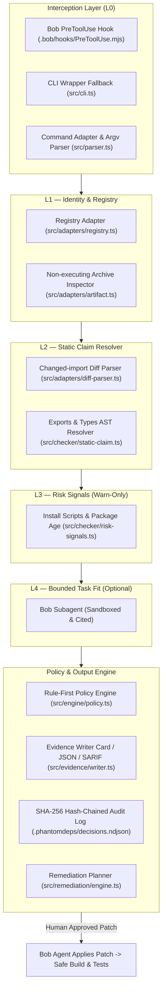
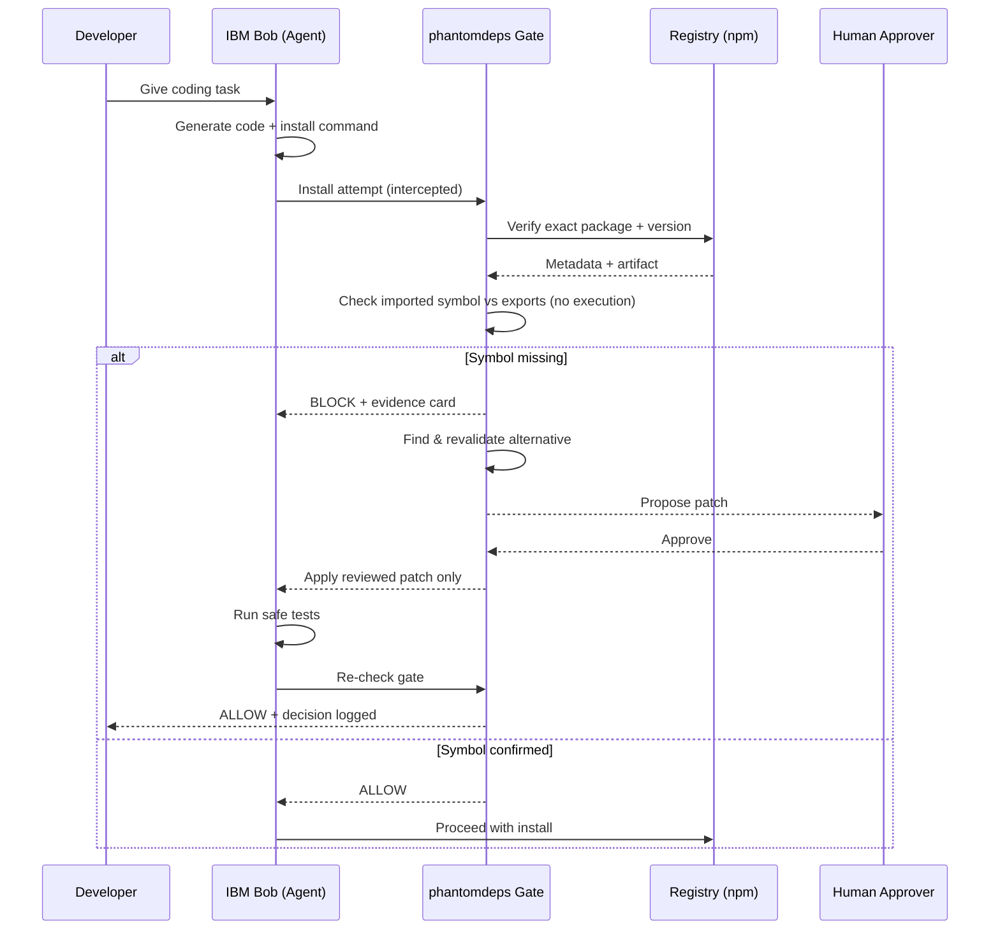
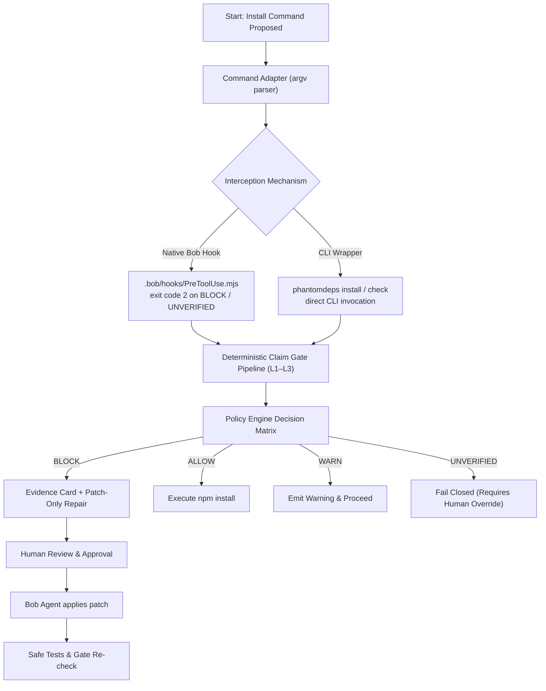

<!-- Status: ACTIVE | Source: .docs/01_RESEARCH/phantomdeps_full_reference.md -->
# Technical Architecture — `phantomdeps`

**Status:** `ACTIVE`  
**Reference Document:** [`.docs/01_RESEARCH/phantomdeps_full_reference.md`](../.docs/01_RESEARCH/phantomdeps_full_reference.md)  
**Primary Implementations:** [`src/gate.ts`](../src/gate.ts), [`src/parser.ts`](../src/parser.ts), [`src/adapters/`](../src/adapters/), [`src/checker/`](../src/checker/), [`.bob/hooks/PreToolUse.mjs`](../.bob/hooks/PreToolUse.mjs)

---

## 1. Architectural Mission & Invariants

`phantomdeps` is a deterministic-first pre-install claim gate built for AI-assisted software development with IBM Bob. Its purpose is to verify that any dependency an AI coding agent proposes to install:
1. Actually exists on the authoritative registry with valid artifact integrity.
2. Actually exports the exact symbols and APIs that the generated code imports.
3. Does not exhibit active supply-chain risk signals (such as unexpected install scripts or extreme recency).
4. Produces a tamper-evident, cryptographically chained audit trail with revalidated, patch-only remediation.

### Core Security Invariants
- **Zero Arbitrary Code Execution:** The architecture never imports, evaluates, or runs untrusted package code (`postinstall` scripts or runtime code). All inspections operate strictly on archive byte streams, package manifest fields, and static TypeScript/JavaScript ASTs.
- **Fail-Closed By Default:** If network outages, timeouts, malformed metadata, or unsupported spec formats prevent verification, the system emits `UNVERIFIED` and exits with code 2 (blocking tool execution). `UNVERIFIED` is never silently converted into `ALLOW`.
- **No Shell Parsing:** Command interception tokenizes argument vectors (`argv`) directly without subshells, preventing command-injection attacks.
- **Traversal-Guarded Tarball Extraction:** Archive unpacking requires and enforces strict `package/` prefixing, neutralizing directory traversal exploits (Zip Slip).

---

## 2. Layered Architecture Diagram



---

## 3. Subsystem Breakdown

### 3.1 Interception Layer (`Client`)
- **Native Bob `PreToolUse` Hook (`.bob/hooks/PreToolUse.mjs`):**
  - Configured via `.bob/settings.json`.
  - Intercepts tool calls before execution. When an `npm install` command is recognized, it parses all targets, checks them against the policy, and exits with `exit 2` if any package triggers `BLOCK` or `UNVERIFIED`.
- **Command Adapter (`src/parser.ts`):**
  - Custom argv tokenizer (`parseHookCommand`).
  - Correctly skips options and flags (including value-bearing flags like `-C`, `--prefix`).
  - Supports option-first syntax (`npm i -D pkg`) and multi-package commands (`npm i lodash is-odd`).
  - Classifies spec types (registry, git, local file, URL, unsafe metacharacters).
- **CLI Wrapper Fallback (`phantomdeps install` / `check`):**
  - Serves as the transparent command-line enforcement layer if hooks are not configured or when running in CI/CD pipelines.

### 3.2 L1 — Identity & Registry Verification
- **Registry Adapter (`src/adapters/registry.ts`):**
  - Performs typed packument queries with 5s timeouts and caching.
  - Distinguishes `PACKAGE_NOT_FOUND` (404) from `PRIVATE_OR_AUTH_REQUIRED` (401/403) and `NETWORK_ERROR`.
  - Detects wrong-ecosystem hallucination (e.g., Python PyPI packages attempted on npm).
  - Validates artifact sha512 integrity against the registry packument digest.
- **Fixture Replay Adapter (`src/adapters/fixture.ts`):**
  - Offline deterministic playback (`fixture://<name>`) for automated tests, demonstrations, and air-gapped environments.

### 3.3 L2 — Static Claim Resolver
- **Diff & Import Parser (`src/parsers/diff-parser.ts`):**
  - Parses multi-file git diffs (`git diff`, `--diff`) or target source files (`--file`) to extract import declarations:
    `import { symbol } from "package-name"` or `require("package-name").symbol`.
  - Maps import changes directly to `ClaimContext` models.
- **Archive & Static AST Inspector (`src/adapters/artifact.ts`, `src/checker/static-claim.ts`):**
  - Downloads and extracts tarball streams in memory without invoking external binaries.
  - Inspects `package.json` `exports` mapping, root index declarations, and TypeScript `.d.ts` definitions.
  - Emits `l2.symbol_missing` (BLOCK) if the claimed symbol does not exist in the package's declared interface.
  - Emits `l2.context_missing` (WARN) if the package is installed without source code import context.

### 3.4 L3 — Risk Signals (Warn-Only)
- **Heuristic Threat Scanners (`src/gate.ts`):**
  - Detects package youth (packages published within the last 7 days).
  - Flags lifecycle install scripts (`hasInstallScript: true`) that could execute pre/postinstall payloads.
  - Checks typosquatting and name-proximity candidates.
  - **Design Constraint:** L3 signals emit `WARN` and never cause false-positive blocks on valid packages.

### 3.5 L4 — Bounded Task Fit (Optional Subagent)
- **Sandboxed Agent Validation:**
  - Designed for high-ambiguity packages.
  - Evaluates package README and problem statement using an isolated, read-only subagent with no shell or network access.

### 3.6 Core Policy Engine & Verifiable Proof Ledger
- **Policy Engine (`src/gate.ts`):**
  - Rule-first aggregation priority: `BLOCK > UNVERIFIED > WARN > ALLOW`.
  - Evaluates structured policy input against configurable threshold rules.
- **Evidence Formatting:**
  - Terminal Evidence Card: Human-readable diagnostic box with citations, integrity status, and remediation guidance.
  - Structured JSON: For machine ingestion.
  - SARIF (Static Analysis Results Interchange Format): For GitHub Code Scanning integration.
- **Tamper-Evident Audit Chain (`src/provenance.ts`, `src/cli.ts`):**
  - Append-only NDJSON log at `.phantomdeps/decisions.ndjson`.
  - Every record includes a cryptographic SHA-256 hash chaining back to the previous record (`previousHash`), timestamp, policy version, and package evidence hash.
  - Verifiable on demand:
    ```bash
    phantomdeps audit-log verify
    ```

---

## 4. End-to-End Interception & Remediation Workflow



---

## 5. Dual-Path Execution & Recovery Architecture



---

## 6. Exit Codes & Gate Semantics

| Exit Code | Verdict | Gate Semantic |
|:---:|---|---|
| **0** | `ALLOW` | All required identity and static claim verifications succeeded. Safe to install. |
| **1** | `WARN` | Identity and API claims verified, but flagged non-blocking risk signals (young package, install scripts). |
| **2** | `BLOCK` | Definitive claim failure: 404 package not found, wrong ecosystem, or symbol missing from exports. Halts execution. |
| **3** | `UNVERIFIED` | Network error, private registry auth required, or unparsable export surface. Fails closed. |
